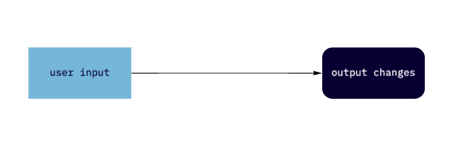
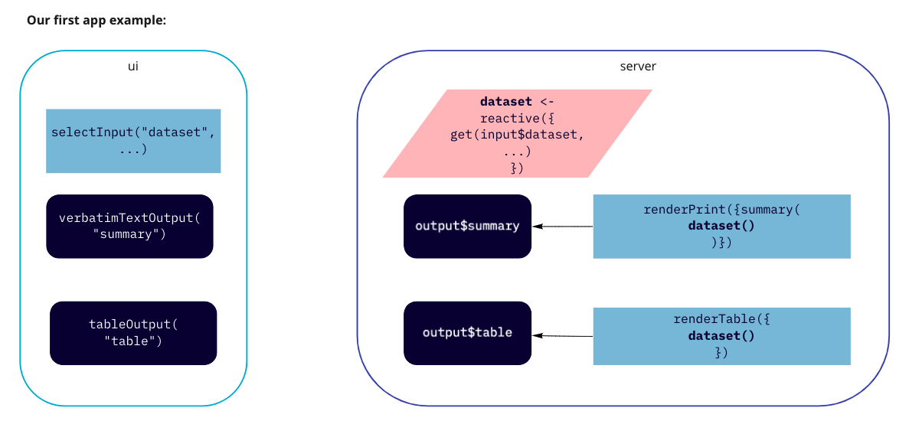

# Your first Shiny app

**Learning objectives:**

- Learn how to **create a simple Shiny app**
- Define the **leanest version** of an app you can build 
- Review different **ways to start and stop** the app 
- Identify the **two key components** of every Shiny app 
- Understand how the two **components are connected**
- Observe how Shiny apps **react to user input** 

## Introduction 

This chapter is basically a quick demo of the minimum boilerplate needed for a Shiny app. 

It defines the two key components - the **ui** and the **server**

Then introduces **reactive programming** - which is how shiny automatically updates outputs when inputs change. 

Shiny outputs (tables, charts etc.) can automatically **react** (recalculate) when their inputs change.  



### If you haven't installed Shiny already: 

```{r install_shiny, eval=FALSE}
install.packages('shiny')
```

Check you have version 1.5.0 or higher

```{r check_package}
packageVersion("shiny")
```

Load shiny 

```{r load_shiny, warning=FALSE}
library('shiny')
```


## Creating an app 

Simplest way - create new directory for your app and add a single `app.r` file


```{r first_app, eval=FALSE}
library(shiny)
ui <- fluidPage(
  "Hello, world!"
)
server <- function(input, output, session) {
}
shinyApp(ui, server)
```

Looking closely at the code above, this app.r file does four things:

1. Loads `shiny`
2. Defines the **ui** - the HTML webpage humans interact with 
3. Specifies behaviour of the app in the **server** 
4. Executes `shinyApp(ui, server)` to construct and start the app 

## Running and stopping the app 

The basic workflow of shiny app development is...

1. Write some code
2. Start the app
3. Play with the app
4. Write some more code
5. Repeat...

### Running the app 

There are a few ways you can run your app 

*If using R Studio:* 

- Click `Run App` button in document toolbar 
- Keyboard shortcut is `CMD / CTRL + SHIFT + ENTER` 

*If not using R Studio:*

- (source()) the whole document or call shiny::runApp()

The console message `#> Listening on http://127.0.0.1:3827` identifies your app in any (local) web browser. 

- `127.0.0.1` is a standard address = this computer 
- last 4 digits = randomly assigned port number 

Running a Shiny app keeps R busy and you will not be able to execute other commands in the console at that time. 

### Stopping the app: 

- `STOP` sign on console toolbar
- `ESC` from within R console (`CTRL + C` is not in R Studio)
- Close shiny app window 


## Adding UI controls

Replace the `ui` in your app with this code that shows you all the built-in data frames in the datasets package. 

```{r ui_1, eval=FALSE}
ui <- fluidPage(
  selectInput("dataset", label = "Dataset", choices = ls("package:datasets")),
  verbatimTextOutput("summary"),
  tableOutput("table")
)
```
Four new functions: 

1. `fluidPage()` - layout function to set up visual structure of page 
2. `selectInput()` - input control for user to interact with 
3. `verbatimTextOutput()` - output control - shows code result
4. `tableOutput` - output control - displays tables

**These are all just ways to generate HTML**

**Note:** `fluidPage()` is just one option available for page setup. `navBarPage()` is a nice example for creating an app with page tabs.

## Adding behaviour 

Need server function to bring the outputs to life 

Reactive programming tells Shiny **how** to perform a function.

This code tells shiny how to fill in the `summary` and `table` outputs we defined in the UI. 

```{r server_1, eval=FALSE}
server <- function(input, output, session) {
  output$summary <- renderPrint({
    dataset <- get(input$dataset, "package:datasets")
    summary(dataset)
  })
  
  output$table <- renderTable({
    dataset <- get(input$dataset, "package:datasets")
    dataset
  })
}
```

Each `output$out_id` is a new shiny output to render where the UI defines it 

There are specific render functions `render{Type}` for different outputs:

- text
- tables
- plots
- images
- new ui components 


## Reactive expressions 

Key part of reducing duplication and ensuring you D-R-Y 

**Duplicated code is particularly bad for Shiny apps which can get cumbersome and more difficult to maintain and debug as they grow**
(Although the latest release of shiny does have some improved debugging tools)

Reactive expressions combines some of the same logic as variables and functions, but is a bit different as these do not work the same in shiny as normal R programming. 

Create a reactive expression by wrapping a block of code in `reactive({...})` and assigning it to a variable. 

You can use the reactive expression like a standard function with **one important difference** - it only runs once and caches the result until input changed. So once it is initialised it will return some form of constant until it's updated again. 

The below code retrieves the dataset once, not twice 

```{r server_2, eval=FALSE}
server <- function(input, output, session) {
  # Create a reactive expression
  dataset <- reactive({
    get(input$dataset, "package:datasets")
  })

  output$summary <- renderPrint({
    # Use a reactive expression by calling it like a function
    summary(dataset())
  })
  
  output$table <- renderTable({
    dataset()
  })
}
```

## Visualising reactive expressions

The flow visualised in 2.1 now has a middle layer - a reactive expression.


Which lives in the server function of the app. The ui to server connections can be visualised like this: 


Using our 'first app' as an example:



## Shiny resources 

Shiny cheatsheet

https://www.rstudio.com/resources/cheatsheets/ 

{width=100%}

### Other resources

**Shiny Gallery** has lots of inspiration and demos of specific ui components and server behaviours. https://shiny.rstudio.com/gallery/ 

**Shiny Widgets Gallery** is included in above link and introduces the main options for inputs in the ui. https://shiny.rstudio.com/gallery/widget-gallery.html 

**Shiny Dashboard** is a nice framework for creating good looking and well structured apps with minimal effort. May get limiting as you advance and want more customisation. https://rstudio.github.io/shinydashboard/index.html


## Meeting Videos

### Cohort 1

`r knitr::include_url("")`

<details>
  <summary> Meeting chat log </summary>
  
```
```
</details>