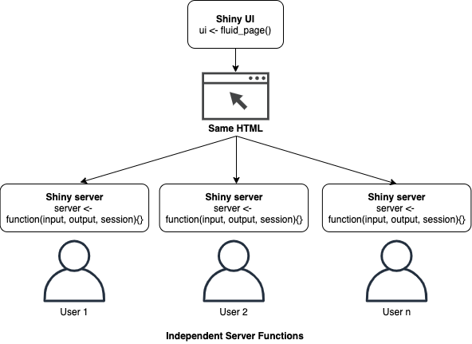
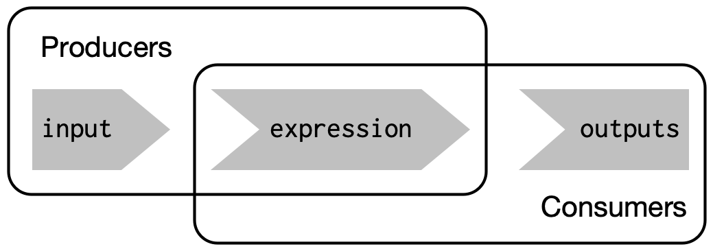
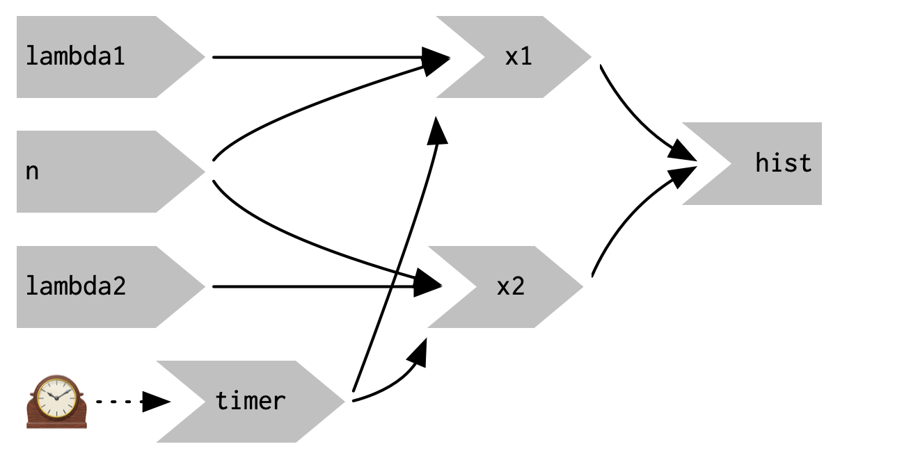
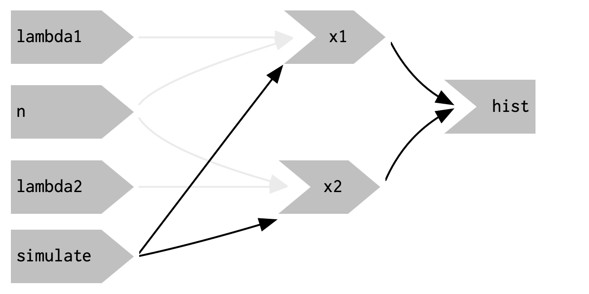
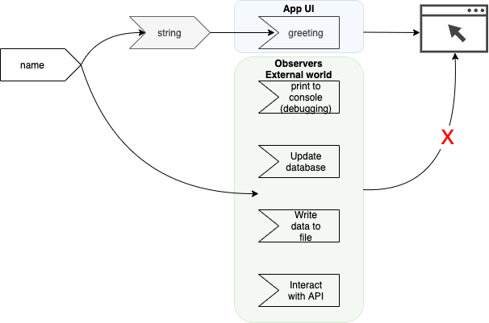

# Basic Reactivity

**Learning objectives:**

* Explain in more detail how the `input` and `output` arguments work.
* Differentiate between imperative vs. declarative programming.
* Describe the basics of reactivity (inputs are directly connected to outputs).
* Apply reactive expressions to eliminate duplicated work.

```{r setup , message=FALSE, echo=FALSE}
library(DiagrammeR)
```

## Recap

```{r intro-graph, echo=FALSE}
mermaid("
graph LR
A[R scripting]-->B[sequential logic]
", height = 200)

mermaid("
graph LR
A[Reactive Programming]-->B[graph of dependencies]
", height = 200)
```

### Important Learnings so far, main app components:

1. **Front end** - the ui object

  - contains the HTML presented to every user of your app.
  - is simple because **every user** gets the **same** HTML.

2.  **Back end** - the server object

  - is more complicated because **every user** needs to get an **independent version** of the app (when user A modifies an input field, user B shouldn't see their outputs change).
  - creates a new environment for each run, giving each session to have a unique state.   
  
  


## A deeper dive into the server function

> server <- function(input, output, session)

1. **input**       
  - list-like object       
  - used for receiving input (sent from the browser)       
  - read-only (no x <- '12' in server; otherwise you'll get an error)       
  - must be read in a reactive context (e.g. renderText() or reactive()) 
      + Otherwise, you'll get an error.


2. **output**     
  - list-like object      
  - used for sending output       
  - **ALWAYS** use with a render fn() - sets up the reactive context & renders the HTML.      


```{r eval=FALSE}
ui <- fluidPage(
  textInput("name", "What's your name?"),
  textOutput("greeting")
)

server <- function(input, output, session) {
  output$greeting <- renderText({
    paste0("Hello ", input$name, "!")
  })
}
```

## Reactive Programming

> Reactive programming is an elegant and powerful programming paradigm, but it can be disorienting at first because it's a very different paradigm to writing a script. ~Hadley Wickham (Author)

Mental Model       
- tell vs inform (providing Shiny with recipes, not giving it commands).  
- recipes, not commands.

### Imperative vs declarative programming

Key differences between two important styles of programming:         

- **Imperative programming** - issue a specific command and it’s carried out immediately.       
- **Declarative programming** - express higher-level goals or describe important constraints, and rely on someone else to decide how and/or when to translate that into action.       

- Imperative code is assertive; declarative code is passive-aggressive       
- “Make me a sandwich” vs “Ensure there is a sandwich in the refrigerator whenever I look inside of it”       

In essence, you describe your overall goals, and the software figures out how to achieve them without further intervention. 

## Laziness

It allows apps to be extremely lazy:

- Shiny's aim is to only do the work that is needed. 
- It will only update outputs that you can currently see. 

### Will this app work?

```{r, eval=FALSE}
library(shiny)

ui <- fluidPage(
  textInput("name", "What is your name?"),
  textOutput("greeting"),
  textOutput("nice_day")
)

server <- function(input, output, session) {
  output$greeting <- renderText(str_c("Hello ", input$name, "!"))
  
  output$nic_day <- renderText(str_c("Have a nice day, ", input$name, "!"))
}

shinyApp(ui, server)
```

_CAUTION_: If you’re working on a Shiny app and you just can’t figure out why your code never gets run, double check that your UI and server functions are using the same identifiers. 

## The reactive graph

- understanding order of execution
- code is only run when needed

**Reactive graph**


- describes how inputs and outputs are connected
- is a diagram identifying the **reactive dependencies**
- describe this relationship (`output` has a reactive dependency on `input`)

```{r reactive-graph, echo=FALSE}
mermaid("
graph LR
A[name] --- B>greeting]
", height = 200)
```

A reactive graph is a powerful tool for understanding how your app works.       
- Make by hand     
- Use DiagrammeR pkg to make it manually yourself     
- Use [`reactlog`](https://rstudio.github.io/reactlog/) package to do it automatically (more in later chapters)       

## Reactive expressions

**What** - A tool that **reduces duplication** in your reactive code by introducing additional nodes into the reactive graph       

**How** - using `reactive()`      

```{r}
# Just for example

server <- function(input, output, session) {
  string <- reactive(paste0("Hello ", input$name, "!"))
  output$greeting <- renderText(string())
}
```

```{r reactive-graph-with-reactive() , echo=FALSE}
mermaid("
graph LR
A[name] --- B>string]
B>string] --- C>greeting]
", height = 200)
```

In other words, `reactive` makes apps cleaner & more efficient (by removing redundant codes & recomputation).
It also simplifies the reactive graph.

Reactive expressions have a flavour of both inputs and outputs:

- Like inputs, you can use the results of a reactive expression in an output.
- Like outputs, reactive expressions depend on inputs and automatically know when they need updating.

## New vocab - producers and consumers

- **producers** to refer to reactive inputs and expressions, and 
- **consumers** to refer to reactive expressions and outputs

**Diagram taken from the book:**


Review the example app testing the difference between two simulated samples. 

## Execution order   

- determined solely by the reactive graph (and not the order of lines of code/layout in the _server_ function unlike normal R scripts)

```{r reactive-execution, eval=FALSE}
# This code will work, but it's not easy to read
server <- function(input, output, session) {
  output$greeting <- renderText(string())
  string <- reactive(paste0("Hello ", input$name, "!"))
}
```


## Controlling timing of evaluation

### **_Timed invalidation_**        
**How** - using `reactiveTimer()`

```{r timed-invalidation-example}
server <- function(input, output, session) {
  timer <- reactiveTimer(500)
  
  x1 <- reactive({
    timer()
    rpois(input$n, input$lambda1)
  })
  x2 <- reactive({
    timer()
    rpois(input$n, input$lambda2)
  })
  
  output$hist <- renderPlot({
    freqpoly(x1(), x2(), binwidth = 1, xlim = c(0, 40))
  }, res = 96)
}
```


Diagram taken from the book


### **_On click_**       
**How** - using `actionButton()`, `eventReactive()`  

```{r on-click-example, eval=FALSE}
## UI excluded to save space, but it contains the `actionButton()` input
server <- function(input, output, session) {
  x1 <- eventReactive(input$simulate, {
    rpois(input$n, input$lambda1)
  })
  x2 <- eventReactive(input$simulate, {
    rpois(input$n, input$lambda2)
  })

  output$hist <- renderPlot({
    freqpoly(x1(), x2(), binwidth = 1, xlim = c(0, 40))
  }, res = 96)
}
```

Diagram from book:


## Observers

### When might you use an observer?

- Anytime you need to make a call out of the application.
   + Saving a file to a shared drive
   + Sending data to an API
   + Updating a database
   + Printing a debugging message
   
- Observers don't affect how the app looks.



There are two important differences between `observeEvent()` and `eventReactive()`:

1.  You don't/can't assign the result of observeEvent() to a variable, so\
2.  You can't refer to it from other reactive consumers.

## Acknowledgements

```{r example}
mermaid("
graph LR
A(Rounded)-->B[Rectangular]
B-->C{A Rhombus}
C-->D[Rectangle One]
C-->E[Rectangle Two]
")
```

```{r reactive-graph-exercise}
mermaid("
graph LR
A[A arr_text] --- B>A arrowtext]
")
```

## Meeting Videos

### Cohort 1

`r knitr::include_url("https://www.youtube.com/embed/7MGCPxPo0m8")`

<details>
  <summary> Meeting chat log </summary>
  
```
00:08:22	Russ Hyde:	Hi Everyone
00:14:31	Russ Hyde:	The chapter numbers have actually changed; so this week is chapter 3 (according to the current website). The preface is now unnumbered
00:23:13	Russ Hyde:	Discussion of persistence of user sessions.
00:23:18	Robert Overman:	https://shiny.rstudio.com/articles/reconnecting.html this says something about it
00:25:21	shamsuddeen:	In the past, users of Shiny applications would get disconnected from the server and see the browser window “gray out” if the network connection was interrupted, even if it was just briefly. This could frustrate and confuse users, and it could lead to the impression that the application was unstable, when in fact the problem was the network connection.

To improve the user experience, we’ve made changes in Shiny Server (Pro and Open Source) 1.4.7, RStudio Connect 1.5.10, and in Shiny 0.14 to allow a Shiny client to seamlessly reconnect to the server even when there is disruption of network service.
00:31:30	shamsuddeen:	Imperative code is assertive; declarative code is passive-aggressive.
00:42:13	Russ Hyde:	https://cran.r-project.org/web/packages/DiagrammeR/index.html
00:44:15	Russ Hyde:	https://cran.r-project.org/web/packages/reactlog/index.html
01:03:19	Russ Hyde:	Great. Thanks for covering such a lot of content
01:07:56	shamsuddeen:	Ok, thank you all. I had to attend another meeting now. See you next.
```
</details>

### Cohort 2

`r knitr::include_url("https://www.youtube.com/embed/br0RE1uORgk")`

### Cohort 3

`r knitr::include_url("https://www.youtube.com/embed/DzyZIEP2knQ")`


### Cohort 4

`r knitr::include_url("https://www.youtube.com/embed/pXvqryklIg0")`

<details>
  <summary>Meeting chat log</summary>
```
00:25:18	Trevin Flickinger:	spelling
00:30:58	Trevin Flickinger:	R4DS - “You should consider writing a function whenever you’ve copied and pasted a block of code more than twice (i.e. you now have three copies of the same code).”
00:31:04	Trevin Flickinger:	https://r4ds.had.co.nz/functions.html#when-should-you-write-a-function
00:33:56	Matthew Efoli:	()
00:34:01	Matthew Efoli:	{}
00:39:15	Trevin Flickinger:	“Note that the {} are only required in render functions if need to run multiple lines of code. As you’ll learn shortly, you should do as little computation in your render functions as possible, which means you can often omit them.”
00:39:23	Trevin Flickinger:	https://mastering-shiny.org/basic-ui.html?q=multiple%20lines#text
00:59:15	Trevin Flickinger:	I think it depends on what you want to do as well, but just R/Shiny will let you do pretty much anything
01:07:46	Trevin Flickinger:	I need to head out, thanks @Matthew
```
</details>


### Cohort 5

`r knitr::include_url("https://www.youtube.com/embed/URL")`

<details>
  <summary>Meeting chat log</summary>
```
LOG
```
</details>
