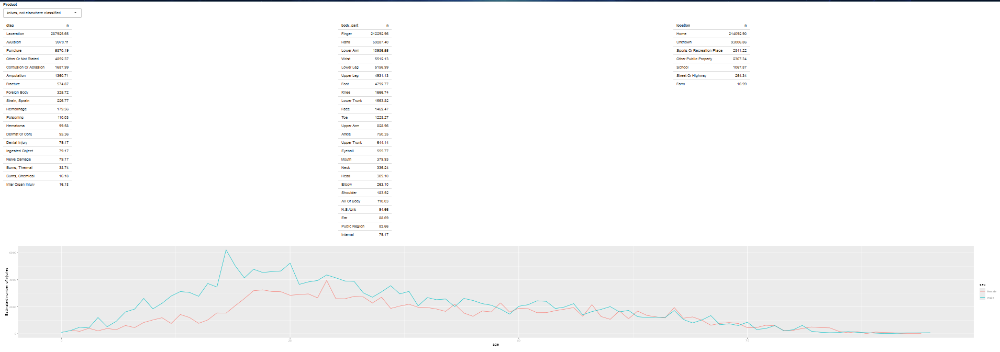
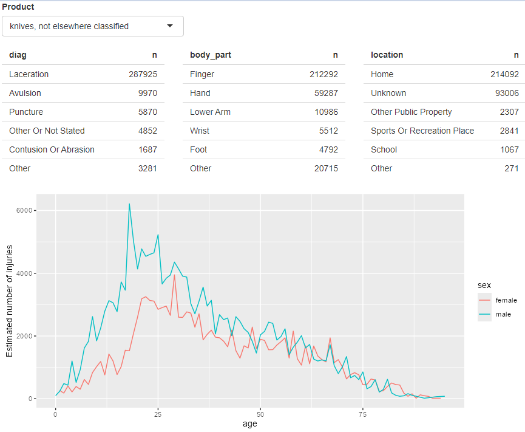

# Case study: ER injuries

**Learning objectives:**

- Learn how to **create a more complex Shiny app**
- Get an idea **how to build your app based on your data exploration**
- Learn how to **create your app step-by-step**
- Get more comfortable **using the techniques you learned so far**


[image source](https://x.com/USCPSC/status/1033024826380771331)


## Introduction

This chapter is about building a more complex app with the tools we learned in the previous chapters.

We're going to use the following packages:

```{r package-list, message=FALSE, warning=FALSE}
library(shiny)     #framework
library(vroom)     #to load the TSV files
library(tidyverse) #data wrangling
```

<details><summary>Session Info</summary>
```{r}
utils::sessionInfo()
```

</details>


## The data

We're exploring data from the National Electronic Injury Surveillance System (NEISS), which covers **accidents reported from a sample of hospitals in the US**. The data set is from Hadley Wickham's [GitHub repository](https://github.com/hadley/mastering-shiny/raw/main/neiss/).

For every accident / injured person we have

- **date**,
- **age**,
- **sex**,
- **race**,
- **body part**,
- **diagnosis** and
- **location** (Home, School, Street Or Highway etc.)

as well as

- **primary product** associated with the injury and
- **a brief story** how the accident occured.

Further we have a **weight** attribute for an estimation how may people the current case represents if the dataset was scaled to the entire US population.

<details><summary>Code to download the data:</summary>

```{r download-data}
dir.create("neiss")

download <- function(name) {
  url <- "https://github.com/hadley/mastering-shiny/raw/main/neiss/"
  download.file(paste0(url, name), paste0("neiss/", name), quiet = TRUE)
}

download("injuries.tsv.gz")
download("population.tsv")
download("products.tsv")
```

</details>

Main data tibbles:

```{r main-data, message=FALSE}
injuries <- vroom("neiss/injuries.tsv.gz")
injuries
```

Product names:

```{r product-data, message=FALSE}
products <- vroom("neiss/products.tsv")
prod_codes <- setNames(products$prod_code, products$title)
products
```

Population data:

```{r population-data, message=FALSE}
population <- vroom("neiss/population.tsv")
population
```


## Exploration

As motivation for the app we want to build, we're going to explore the data.

Let's have a look at accidents related to toilets:

```{r no-toilets}
# product code for toilets is 649
selected <- injuries %>% filter(prod_code == 649)

# nrow(selected): 2993
```

We're interested in how many accidents related to toilets we see for different locations, body parts and diagnosis.

```{r count-toilets}
selected %>%
  count(location, wt = weight, sort = TRUE)

selected %>%
  count(body_part, wt = weight, sort = TRUE)

selected %>%
  count(diag, wt = weight, sort = TRUE)
```

<details><summary>Weights?</summary>

* The [NEISS data dictionary](https://www.cpsc.gov/Research--Statistics/NEISS-Injury-Data) calls this column "Statistical Weight for National Estimates"
* perhaps a form of [propensity weighting](https://www.pewresearch.org/methods/2018/01/26/how-different-weighting-methods-work/)

</details>

Next we'll we create a plot for the number of accidents for different age and sex:

```{r line-plot}
summary <- selected %>%
  count(age, sex, wt = weight) %>% 
  left_join(y = population, by = c("age", "sex")) %>% 
  mutate(rate = n / population * 1e4)

summary %>%
  ggplot(mapping = aes(x = age, y = rate, color = sex)) +
  geom_line(na.rm = TRUE) +
  labs(y = "Injuries per 10,000 people")
```

### Facet Wrap

Let us briefly look at all of the injury types in the data set.

```{r, echo = FALSE, eval = TRUE}
injuries |>
  group_by(prod_code) |>
  count(age, sex, wt = weight) |> 
  left_join(y = population, by = c("age", "sex")) |>
  mutate(rate = n / population * 1e4) |>
  ggplot(mapping = aes(x = age, y = rate, color = sex)) +
  geom_line(na.rm = TRUE) +
  facet_wrap(vars(prod_code)) +
  labs(title = "Accidents reported to emergency rooms in the US",
       subtitle = "sample from 2013 to 2017",
       caption = "Source: NEISS",
       x = "Age",
       y = "Injuries per 10,000 people")
```

<details><summary>Image code</summary>

```{r, echo = TRUE, eval = FALSE}
injuries |>
  group_by(prod_code) |>
  count(age, sex, wt = weight) |> 
  left_join(y = population, by = c("age", "sex")) |>
  mutate(rate = n / population * 1e4) |>
  ggplot(mapping = aes(x = age, y = rate, color = sex)) +
  geom_line(na.rm = TRUE) +
  facet_wrap(vars(prod_code)) +
  labs(title = "Accidents reported to emergency rooms in the US",
       subtitle = "sample from 2013 to 2017",
       caption = "Source: NEISS",
       x = "Age",
       y = "Injuries per 10,000 people")
```

</details>


> The goal is to build an app, which **outputs the tables and the plot for different products**, which the *user selects*.


## Prototype

The first version of the app is a dashboard, where the user can choose a product and get the tables and the plot we have seen in the previous chapter.

Code of the ui:

```{r prototype-ui, eval=FALSE}
ui <- fluidPage(
  # choose product
  fluidRow(
    column(
      width = 6,
      selectInput(inputId = "code", label = "Product", choices = prod_codes)
    )
  ),
  # display tables
  fluidRow(
    column(width = 4, tableOutput(outputId = "diag")),
    column(width = 4, tableOutput(outputId = "body_part")),
    column(width = 4, tableOutput(outputId = "location"))
  ),
  # display plot
  fluidRow(
    column(width = 12, plotOutput(outputId = "age_sex"))
  )
)
```

Code of the server:

```{r prototype-server, eval=FALSE}
server <- function(input, output, session) {
  # reactive for filtered data frame
  selected <- reactive(
    injuries %>%
      filter(prod_code == input$code)
  )
  
  # render diagnosis table
  output$diag <- renderTable(
    selected() %>%
      count(diag, wt = weight, sort = TRUE)
  )
  
  # render body part table
  output$body_part <- renderTable(
    selected() %>%
      count(body_part, wt = weight, sort = TRUE)
  )
  
  # render location table
  output$location <- renderTable(
    selected() %>%
      count(location, wt = weight, sort = TRUE)
  )
  
  # reactive for plot data
  summary <- reactive(
    selected() %>%
      count(age, sex, wt = weight) %>%
      left_join(y = population, by = c("age", "sex")) %>%
      mutate(rate = n / population * 1e4)
  )
  
  # render plot
  output$age_sex <- renderPlot(
    expr = {
      summary() %>%
        ggplot(mapping = aes(x = age, y = n, colour = sex)) +
        geom_line() +
        labs(y = "Estimated number of injuries")
    },
    res = 96
  )
}
```

_Note:_ The reactive for plot data is only used once. You could also compute the dataframe when rendering the plot, but it is good practise to **seperate computing and plotting**. It's easier to understand and generalise.

This prototype is available at https://hadley.shinyapps.io/ms-prototype/.




## Polish tables
Now we're going to improve the app step-by-step.

The prototype version of the app has very long tables. To make it a little clearer we only want to show the top 5 and lump together all other categories in every table.

As an example the diagnosis table for all products would look like this:

```{r diag-table}
injuries %>%
  mutate(diag = fct_lump(fct_infreq(diag), n = 5)) %>%
  group_by(diag) %>%
  summarise(n = as.integer(sum(weight)))
```

### Exercise 4.8.2

2. What happens if you flip `fct_infreq()` and `fct_lump()` in the code that reduces the summary tables?

<details><summary>Answer</summary>
```{r diag-table-alt}
injuries %>%
  mutate(diag = fct_infreq(fct_lump(diag, n = 5))) %>%
  group_by(diag) %>%
  summarise(n = as.integer(sum(weight)))
```

This order lumped the rarer conditions into "Other" and then did the sorting.  However, since "Other" was the most frequent label, `fct_infreq()` then put "Other" at the top, which is less desirable.

</details>

### Hadley's Fix

<details><summary>Hadley's Code</summary>
```{r, eval = FALSE}
count_top <- function(df, var, n = 5) {
  df %>%
    mutate({{ var }} := fct_lump(fct_infreq({{ var }}), n = n)) %>%
    group_by({{ var }}) %>%
    summarise(n = as.integer(sum(weight)))
}

output$diag <- renderTable(count_top(selected(), diag), width = "100%")
output$body_part <- renderTable(count_top(selected(), body_part), width = "100%")
output$location <- renderTable(count_top(selected(), location), width = "100%")
```

</details>



## Rate vs count

Next step is to give the user the chance to plot the data relative to 10,000 People or in absolute numbers.

The new ui looks like this:

```{r rate-count-ui, eval=FALSE}
ui <- fluidPage(
  fluidRow(
    column(
      width = 8,
      selectInput(
        inputId = "code",
        label = "Product",
        choices = prod_codes,
        width = "100%"
      )
    ),
    column(
      width = 2,
      selectInput(inputId = "y", label = "Y axis", choices = c("rate", "count"))
    )
  ),
  fluidRow(
    column(width = 4, tableOutput(outputId = "diag")),
    column(width = 4, tableOutput(outputId = "body_part")),
    column(width = 4, tableOutput(outputId = "location"))
  ),
  fluidRow(
    column(width = 12, plotOutput(outputId = "age_sex"))
  )
)
```

And plot rendering changes to:

```{r rate-count-server, eval=FALSE}
server <- function(input, output, session) {
  ...
  
  output$age_sex <- renderPlot(
    expr = {
      if (input$y == "count") {
        summary() %>%
          ggplot(mapping = aes(x = age, y = n, colour = sex)) +
          geom_line() +
          labs(y = "Estimated number of injuries")
        
      } else {
        summary() %>%
          ggplot(mapping = aes(x = age, y = rate, colour = sex)) +
          geom_line(na.rm = TRUE) +
          labs(y = "Injuries per 10,000 people")
      }
    },
    res = 96
  )
}
```


## Narrative

Now we want a button to sample an accident story related to the currently chosen product and display it.

We add the following ui elements:

```{r narrative-ui, eval=FALSE}
ui <- fluidPage(
  ...
  fluidRow(
    column(
      width = 2,
      actionButton(inputId = "story", label = "Tell me a story")
    ),
    column(width = 10, textOutput(outputId = "narrative"))
  )
)
```

In the backend we need an `eventReactive` that triggers, when the button is clicked or the selected data changes:

```{r narrative-server, eval=FALSE}
server <- function(input, output, session) {
  ...
  
  narrative_sample <- eventReactive(
    eventExpr = list(input$story, selected()),
    valueExpr = selected() %>%
      pull(narrative) %>%
      sample(1)
  )
  
  output$narrative <- renderText(narrative_sample())
}
```

The resulting version of the app is available at https://hadley.shinyapps.io/ms-prototype/.


## Exercises

1. Draw the reactive graph for each app.

2. What happens if you flip `fct_infreq()` and `fct_lump()` in the code that reduces the summary tables?

<details><summary>Answer</summary>
```{r diag-table-2}
injuries %>%
  mutate(diag = fct_infreq(fct_lump(diag)), n = 5) %>%
  group_by(diag) %>%
  summarise(n = as.integer(sum(weight)))
```


This order lumped the rarer conditions into "Other" and then did the sorting.  However, since "Other" was the most frequent label, `fct_infreq()` then put "Other" at the top, which is less desirable.

</details>

3. Add an input control that lets the user decide how many rows to show in the summary tables.

<details><summary>Answer</summary>

> refer to code in next section

</details>

4. Provide a way to step through every narrative systematically with forward and backward buttons. Advanced: Make the list of narratives “circular” so that advancing forward from the last narrative takes you to the first.


## DSLC Customs

Some people in the cohort were brainstorming ideas on how to continue to improve this Shiny app.  Here are some of the ideas.

### UI

```{r, eval = FALSE}
library("gt")
library("shiny")
library("tidyverse")

injuries   <- readr::read_csv("injuries.csv")
population <- readr::read_csv("population.csv")
products   <- readr::read_csv("products.csv")
prod_codes <- setNames(products$prod_code, products$title)

count_top <- function(df, var, n = 5) {
  df |>
    mutate({{ var }} := fct_lump(fct_infreq({{ var }}), n = n)) %>%
    group_by({{ var }}) %>%
    summarise(n = as.integer(sum(weight))) |>
    
    # gt table
    gt() |>
    cols_align(align = "center") |>
    tab_style(
      style = list(cell_fill(color = "#F9E3D6")),
      locations = cells_body(columns = {{ var }})
    ) |>
    tab_style(
      style = list(cell_fill(color = "lightcyan")),
      locations = cells_body(columns = n)
    )
}

ui <- fluidPage(
  # choose product
  fluidRow(
    column(
      width = 6,
      selectInput(
        inputId = "code",
        label = "Product",
        choices = prod_codes,
        width = "100%"
      )
    ),
    column(
      width = 2,
      selectInput(inputId = "y", label = "Y axis", choices = c("rate", "count"))
    ),
    column(
      width = 4,
      sliderInput(inputId = "n_products", label = "number of products",
                  min = 1, max = 20, value = 5, step = 1)
    )
  ),
  
  
  # display tables
  fluidRow(
    column(width = 4, tableOutput(outputId = "diag")),
    column(width = 4, tableOutput(outputId = "body_part")),
    column(width = 4, tableOutput(outputId = "location"))
  ),
  # display plot
  fluidRow(
    column(width = 12, plotOutput(outputId = "age_sex"))
  )
  
  # narrative button
  ,
  fluidRow(
    column(
      width = 2,
      actionButton(inputId = "story", label = "Tell me a story")
    ),
    column(width = 10, textOutput(outputId = "narrative"))
  )
)
```


### Server

```{r, eval = FALSE}
server <- function(input, output, session) {
  # reactive for filtered data frame
  selected <- reactive(
    injuries %>%
      filter(prod_code == input$code)
  )
  num_products <- reactive(input$n_products)
  
  # retrieve injury type
  prod_name <- reactive(products$title[products$prod_code == input$code])

  # reactive for plot data
  summary <- reactive(
    selected() %>%
      count(age, sex, wt = weight) %>%
      left_join(y = population, by = c("age", "sex")) %>%
      mutate(rate = n / population * 1e4)
  )
  
  output$diag      <- render_gt(count_top(selected(), diag, num_products()), 
                                width = "100%")
  output$body_part <- render_gt(count_top(selected(), body_part, num_products()),  
                                width = "100%")
  output$location  <- render_gt(count_top(selected(), location, num_products()),  
                                width = "100%")
  
  # render plot
  output$age_sex <- renderPlot(
    expr = {
      if (input$y == "count") {
        summary() %>%
          ggplot(mapping = aes(x = age, y = n, colour = sex)) +
          geom_line() +
          labs(title = "Accidents reported to emergency rooms in the US",
               subtitle = prod_name(),
               caption = "Source: NEISS",
               x = "Age",
               y = "Estimated number of injuries") +
          theme_minimal()
        
      } else {
        summary() %>%
          ggplot(mapping = aes(x = age, y = rate, colour = sex)) +
          geom_line(na.rm = TRUE) +
          labs(title = "Accidents reported to emergency rooms in the US",
               subtitle = prod_name(),
               caption = "Source: NEISS",
               x = "Age",
               y = "Injuries per 10,000 people") +
          theme_minimal()
      }
    },
    res = 96
  )
  
  # narrative reactive
  narrative_sample <- eventReactive(
    eventExpr = list(input$story, selected()),
    valueExpr = selected() %>%
      pull(narrative) %>%
      sample(1)
  )
  output$narrative <- renderText(narrative_sample())
}

# Run the application 
shinyApp(ui = ui, server = server)
```


## Meeting Videos

### Cohort 1

`r knitr::include_url("https://www.youtube.com/embed/K1GMxASFaLc")`

<details>
  <summary> Meeting chat log </summary>
  
```
00:13:23	Russ Hyde:	Hi all. Welcome to this week's Mastering Shiny talk
00:20:33	Matt C:	What is the correlation between head injuries and toilets? Hm...
00:36:58	Morgan Grovenburg:	Very cool Dave!
00:37:07	priyanka gagneja:	awesome 
00:37:15	Federica Gazzelloni:	great
00:38:44	Robert Overman:	https://www.jdtrat.com/packages/shinysurveys/
00:39:17	priyanka gagneja:	lol what a coincidence.. I have recently played with this pkg 
00:39:55	priyanka gagneja:	it's neat one .. so low cost to create a survey and then you can save the results in a Google sheet .. using googlsheets4 pkg 
00:43:44	priyanka gagneja:	rhandsontable
00:43:49	Federica Gazzelloni:	thanks
00:46:12	priyanka gagneja:	if you only looking to change the look of the table only russ, gt and kable could be useful 
00:46:25	priyanka gagneja:	and even reactable,  DT would be others 
00:46:36	shamsuddeen:	KableExtra is also cool
00:47:31	shamsuddeen:	https://github.com/haozhu233/kableExtra
00:49:58	priyanka gagneja:	https://rstudio.github.io/reactlog/articles/reactlog.html
00:57:03	Russ Hyde:	mutate(df, {{var}} := f({{var}}))
00:57:38	priyanka gagneja:	uhh noo
00:58:21	Robert Overman:	I mean I have enough trouble remembering !!rlang::sym(x) remembering that this now works as {{x}} is going to make my head hurt
00:58:36	Arnab Dey (he/him):	Thank you Dave, for an excellent presentation!!
```
</details>

### Cohort 2

`r knitr::include_url("https://www.youtube.com/embed/tQW3E6POwLw")`

<details>
  <summary> Meeting chat log </summary>
  
```
00:11:36	Ryan Metcalf:	https://www.infoworld.com/article/3516150/create-a-shiny-app-to-search-twitter-with-rtweet-and-r.amp.html
```
</details>

### Cohort 3

`r knitr::include_url("https://www.youtube.com/embed/VCuaOLXLOZ4")`

<details>
  <summary>Meeting chat log</summary>
```
00:15:13	Njoki Njuki Lucy:	I don't know yet but we can ask on the slack channel for more info!
00:15:25	Njoki Njuki Lucy:	so far so good.
```
</details>


### Cohort 4

`r knitr::include_url("https://www.youtube.com/embed/dR7HRUm3QHs")`


### Cohort 5

`r knitr::include_url("https://www.youtube.com/embed/URL")`

<details>
  <summary>Meeting chat log</summary>
```
LOG
```
</details>
