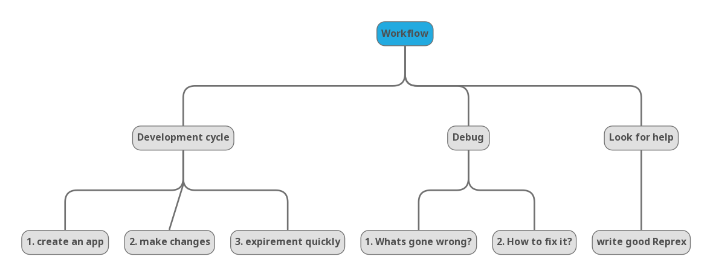
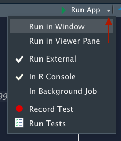
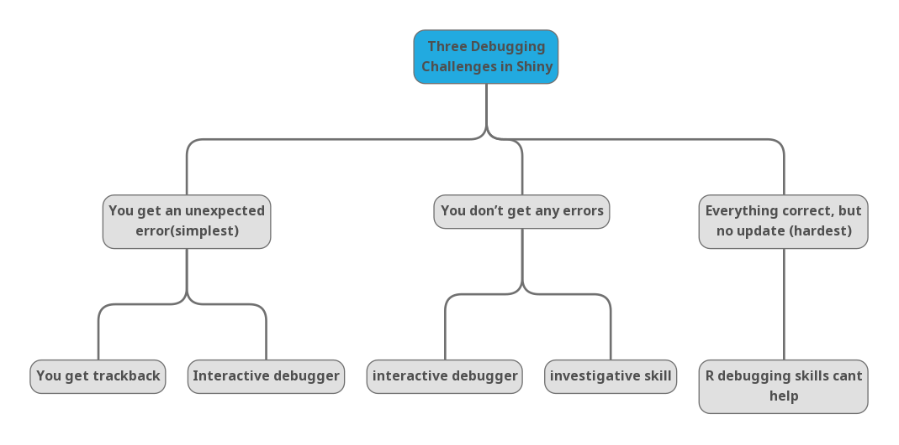
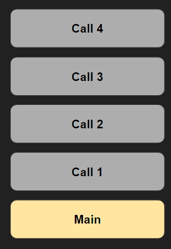

# Workflow 

## Why workflow? 

> "I think of workflow as one of my "secret" powers: one of the reasons that I've been able to accomplish so much is that I devote time to analysing and improving my workflow. I highly encourage you to do the same!" -Hadley Wickham (author)

-   Workflow makes the process of writing Shiny apps more enjoyable, and helps your skills improve more quickly.

## Learning objectives

- The goal of this chapter is to help you improve three important Shiny workflows:


    -   Learn basic **development cycle** for creating apps,making changes, and quickly expirement with the results.

    -   Learn how to **debug** Shiny apps
    
    -   Learn how to write **self-contained reprexes**

  

## Development workflow 

-   Why development workflow?

    - Allows you to reduce the time between making a change and seeing the outcome

    - The faster you can iterate and experiment, the faster you will become a better Shiny developer.
 
- Two main workflows to optimize here:

    -   creating apps (for first time),

    -   making changes and experimenting with the results faster (speeding up the iterative cycle).

## Creating apps 

- Every shiny app has the same six lines of code.

```{r eval=FALSE}
library(shiny)
ui <- fluidPage(
)
server <- function(input, output, session) {
}
shinyApp(ui, server)
```

- Type `shinyapp` in `app.R` and you will see prompt to insert snippet (Shift + Tab).

- If you are using RStudio, you can create Shiny Web Application project easily via the file menu.

    - `File` >> `New Project` >> `New Directory` >> `Shiny Web Application`

## Seeing your changes faster 

> At most, you'll *create* a few apps a day, but you'll **run** apps hundreds of times, so mastering the development workflow is particularly important. - Hadley Wickham (author)

- Avoid clicking the "Run App" button

- Use keyboard shortcut: `Cmd/Ctrl + Shift + Enter`

- Turn auto reload on and run the app in the background as described [here](https://github.com/sol-eng/background-jobs/tree/master/shiny-job).

    - Gives faster workflow: write some code, `Cmd/Ctrl + S` to save the file and experiment interactively.
    
    - **Disadvantage:** harder to debug because the app is running in a separate process.
    
    - Bigger apps: interactive testing >> automated testing (Chapter 21).
    
    - Demo starting an app as a local job.
    
## Controlling the view 

-   Run in Viewer Pane: opens the app in the viewer pane . for smaller apps

-   Run External: opens the app in your usual web browser.
 
     - useful for larger apps

**Submenu used to change the view (click the drop-down)**

<center>     
     
</center>

##  Debugging 

> It's an eight line app, what could possibly go wrong? -Hadley Wickham (author)

> The process of systematically comparing your expectations to reality until you find the mismatch. -Hadley Wickham (author)

- something will go wrong definitely. 

- it takes years of experience to write code that works the first time (So, we need a robust workflow for identifying and fixing mistakes)

- Specific focus to three debugging challenges to Shiny apps

## Three dubugging Challenges

<!-- A grammatically correct program may give you incorrect results due to logic errors. In case such errors (i.e. bugs) occur, you need to find out why and where they occur so that you can fix them. The procedure to identify and fix bugs is called “debugging”. -->

<!-- - R’s debugging tools include the traceback, browser, debug, debugonce, trace, and recover functions -->

<!-- - it takes years of experience in any language before you can reliably write code that works the first time. -->

<!-- - So, bugs happen. -->

<!-- - Three main cases of problems: -->


  
  
### You get an unexpected error (easiest case). 

- **Solution:  A traceback is returned**
  - Info that points to where the error occurred
  - The interactive debugger is a powerful assistant for this process.

### You don’t get any errors

- **Solution: Use the interactive debugger**
  - A tool to investigative and track down the root cause.

### All the values are correct, but they’re not updated when you expect

- **Solution: Most challenging problem** 
  - It’s unique to Shiny
  - You can’t take advantage of your existing R debugging skills.

## Fixing errors: Tracebacks 

- In R, every error is accompanied by a traceback, or call stack, which literally traces back through the sequence of calls that lead to the error

- The functions are printed in reverse order

- The traceback tool pinpoints the location of an error.
 
  

### Example of reading traceback

```{r}
f <- function(x) g(x)
g <- function(x) h(x)
h <- function(x) 2 * 2

f(3)
```

```{r, eval=FALSE}

f <- function(x) g(x)
g <- function(x) h(x)
h <- function(x) x * 2

f("a")

```

- This will generate an error below

```{r, eval=FALSE}
f("a")
#> Error in x * 2: non-numeric argument to binary operator
```

- The traceback is shown below: 
- Top of the stack points to an error 

```{r, eval=FALSE}

traceback()

#> 3: h(x)
#> 2: g(x)
#> 1: f("a")
```

- Flipping the traceback shows the better sequence(the top of the stack points to an error location)

- shows sequence of calls that lead to the error — f() called g() called h() (which errors)

```{r, eval=FALSE}

1: f("a")
2: g(x)
3: h(x)
```

## Tracebacks in Shiny 
 
- You can’t use `traceback()` in Shiny because you can’t run code while an app is running. 
 
- Shiny automatically prints the traceback for you.
 
```{r eval=FALSE, error= TRUE}
library(shiny)

f <- function(x) g(x)
g <- function(x) h(x)
h <- function(x) x * 2

ui <- fluidPage(
  selectInput("n", "N", 1:10),
  plotOutput("plot")
)
server <- function(input, output, session) {
  output$plot <- renderPlot({
    n <- f(input$n)
    plot(head(cars, n))
  }, res = 96)
}
shinyApp(ui, server)
```
 
- We will see an error below 
 
```{r, eval=FALSE}
Error in *: non-numeric argument to binary operator
  169: g [app.R#4]
  168: f [app.R#3]
  167: renderPlot [app.R#13]
  165: func
  125: drawPlot
  111: <reactive:plotObj>
   95: drawReactive
   82: renderFunc
   81: output$plot
    1: runApp
```
 
- We can also flip the error

```{r, eval=FALSE}
Error in *: non-numeric argument to binary operator
   1: runApp
  81: output$plot
  82: renderFunc
  95: drawReactive
 111: <reactive:plotObj>
 125: drawPlot
 165: func
 167: renderPlot [app.R#13]
 168: f [app.R#3]
 169: g [app.R#4]
```

## Three components to a Shiny error stack

- **First**: few calls start the app. Ignore anything before the first runApp(); this is just the setup code to get the app running.

```{r, eval=FALSE}
1: runApp

#Sometimes, you may see other things before runAPP ignore them
#1: source
#3: print.shiny.appobj
#5: runApp
```

- **Second:** some internal Shiny code in charge of calling the reactive expression(output$plot is where the problem is) :

```{r, eval=FALSE}
 81: output$plot
 82: renderFunc
 95: drawReactive
111: <reactive:plotObj>
125: drawPlot
165: func
```

- **Third**: Code that you have written

```{r, eval=FALSE}
167: renderPlot [app.R#13]
168: f [app.R#3]
169: g [app.R#4]
```

## Fixing errors: Interactive debugger

- When do we use? 
    
    - You have identified the error using `traceback` and want to figure out what’s causing it.
    

- Use the interactive debugger to debug your code

- Two ways to launch the debugger:

- Add a call to `browser()` in your source code

- This can also be done using a conditional statement

```{r, eval=FALSE}
if (input$value == "a") {
  browser()
}
# Or maybe
if (my_reactive() < 0) {
  browser()
}
```
    
- Add an RStudio breakpoint by clicking to the left of the line number

### Useful interactive debugger commands

Use these when you the debugger is up and running:

`n` - next step in the function

`c` - leaves debugger, continues the regular execution of the function

`Q` - stops debugging, terminates the function, and returns to global workspace

## Debugging reactivity

- Hardest problem to debug.

- We need other tools, which are not introduced in this chapter. 

- Use "print" debugging to show your values.

    - Use `message()` here: "standard output" vs "standard error"

## Getting help (using Reprex) 

  
  
- If you cant debug the error, it is time to ask for help at Shiny Community by creating Reprex

- A reprex is just some R code that works when you copy and paste it into a R session on another computer

- Good reprex, makes it easy for others to help you debug your app 

- Below is an example of Shiny reprex

###  How to make a reprex  

- Create a single self-contained file that contains everything needed to run your code (e.g load all packages)

- Test it by restarting fresh R session and then running the code

- Potential problem is sharing your data
    
    - Use built-in datasets(mpg), 
    - create sample datasets and illustrate the problem, 
    - use subset of the data with `dput()`

```{r}
(mydata <- data.frame(x = 1:5, y = c("a", "b", "c", "d", "e")))

```


```{r}
dput(mydata)

```

-  Last resort is to provide complete app.R and the needed data files using Gihub or Zip files (if reading data from disk seems irreducible part of the problem)

- Make sure you use relative paths

- Format your code for to be easy read
  
  - Use `styler` package if you adopt [tidyverse style guide](https://style.tidyverse.org)
  
  
### Making a minimal reprex   

-  Trim out all the code that’s ok (make the life of a helper much easier) rather than forcing a potential helper to understand your entire app.
 
- This process often lead you to discover what the problem is, so you don’t have to wait for help from someone else!

- A good way to find error code is to remove sections of code from your application, piece by piece, until the problem goes away

-  If removing a particular piece of code makes the problem stop, it’s likely that that code is related to the problem. 


####  Example of Bad reprex

- all the needed packages are not loaded
- The code is not style, making it uneasy to help

```{r, eval=FALSE}
library(shiny)

shinyApp(
  ui = fluidPage(
    uiOutput("interaction_slider"),
    verbatimTextOutput("breaks")
  ),
  
  server = function(input, output, session) {
    
    df <- data.frame (dateTime = c("2019-08-20 16:00:00",
                   "2019-08-20 16:00:01",
                   "2019-08-20 16:00:02",
                   "2019-08-20 16:00:03",
                   "2019-08-20 16:00:04",
                   "2019-08-20 16:00:05"),
      var1 = c(9, 8, 11, 14, 16, 1),
      var2 = c(3, 4, 15, 12, 11, 19),
      var3 = c(2, 11, 9, 7, 14, 1)
    )
    
    timeSeries <- as.xts(df[,2:4],order.by=strptime(df[,1], format="%Y-%m-%d %H:%M:%S"))
    print (paste(min(time(timeSeries)),is.POSIXt(min(time(timeSeries))),sep=' '))
    print (paste(max(time(timeSeries)),is.POSIXt(max(time(timeSeries))),sep=' '))
    
    output$interaction_slider <- renderUI({
      sliderInput(
        "slider",
```


####  Making the bad reprex better(minimal)

- loaded needd packages
- The code is style, making it easy to help

```{r, eval=FALSE}
library(xts)
library(lubridate)
library(shiny)

ui <- fluidPage(
  uiOutput("interaction_slider"),
  verbatimTextOutput("breaks")
)
server <- function(input, output, session) {
  df <- data.frame(
    dateTime = c(
      "2019-08-20 16:00:00",
      "2019-08-20 16:00:01",
      "2019-08-20 16:00:02",
      "2019-08-20 16:00:03",
      "2019-08-20 16:00:04",
      "2019-08-20 16:00:05"
    ),
    var1 = c(9, 8, 11, 14, 16, 1),
    var2 = c(3, 4, 15, 12, 11, 19),
    var3 = c(2, 11, 9, 7, 14, 1)
  )

  timeSeries <- as.xts(df[, 2:4], 
    order.by = strptime(df[, 1], format = "%Y-%m-%d %H:%M:%S")
  )
  print(paste(min(time(timeSeries)), is.POSIXt(min(time(timeSeries))), sep = " "))
  print(paste(max(time(timeSeries)), is.POSIXt(max(time(timeSeries))), sep = " "))

  output$interaction_slider <- renderUI({
    sliderInput(
      "slider",
      "Select Range:",
      min = min(time(timeSeries)),
      max = max(time(timeSeries)),
      value = c(min, max)
    )
  })

  brks <- reactive({
    req(input$slider)
    seq(input$slider[1], input$slider[2], length.out = 10)
  })

  output$breaks <- brks
}
shinyApp(ui, server)
```

- Remove part of the code that is independent with the error(e.g  two lines starting with `print()`, timeSeres and df)

- new server calls reduced:

```{r, eval=FALSE}
datetime <- Sys.time() + (86400 * 0:10)

server <- function(input, output, session) {
  output$interaction_slider <- renderUI({
    sliderInput(
      "slider",
      "Select Range:",
      min   = min(datetime),
      max   = max(datetime),
      value = c(min, max)
    )
  })
  
  brks <- reactive({
    req(input$slider)
    seq(input$slider[1], input$slider[2], length.out = 10)
  })
  
  output$breaks <- brks
}
```

- Next, the example uses a relatively sophisticated Shiny technique where the UI is generated in the server function.

- But  the `renderUI()` doesn’t use any reactive inputs, so it should work the UI. this leads to new UI that generate the error:


```{r, eval=FALSE}
ui <- fluidPage(
  sliderInput("slider",
    "Select Range:",
    min   = min(datetime),
    max   = max(datetime),
    value = c(min, max)
  ),
  verbatimTextOutput("breaks")
)
#> Error: Type mismatch for `min`, `max`, and `value`.
#> i All values must have same type: either numeric, Date, or POSIXt.
```


- looking at each of the inputs we’re feeding to min, max, and value to see where the problem is:


```{r, eval=FALSE}
min(datetime)
#> [1] "2021-03-15 23:20:03 UTC"
max(datetime)
#> [1] "2021-03-25 23:20:03 UTC"
c(min, max)
#> [[1]]
#> function (..., na.rm = FALSE)  .Primitive("min")
#> 
#> [[2]]
#> function (..., na.rm = FALSE)  .Primitive("max")
```

- Now the problem is obvious: we haven’t assigned min and max variables


```{r, eval=FALSE}
ui <- fluidPage(
  sliderInput("slider",
    "Select Range:",
    min   = min(datetime),
    max   = max(datetime),
    value = range(datetime)
  ),
  verbatimTextOutput("breaks")
)
```


## Meeting Videos

### Cohort 1

`r knitr::include_url("https://www.youtube.com/embed/I3Bn03_9Ogk")`

<details>
  <summary> Meeting chat log </summary>
  
```
00:04:01	Russ Hyde:	Hi Everyone. Welcome to this weeks bookclub meeting.
00:05:43	Diamantis Sellis:	Hi, thanks for organizing!
00:05:52	docksbox@pm.me:	Hello!
00:07:45	Russ Hyde:	So. Shamsudeen should be presenting today.
00:12:21	Russ Hyde:	Hi everyone. Are you able to hear Shamsuddeen ok?
00:12:27	priyanka gagneja:	yes
00:12:31	Anne Hoffrichter:	yes
00:12:32	Diamantis Sellis:	yes
00:15:27	Jessica Mukiri:	Hey have you just stared or the daylight savings taken effect yet?
00:17:28	Kent J:	DST started on Sunday morning in Boston.
00:42:35	Russ Hyde:	Is it options(shiny.fullstacktrace = TRUE)?
00:42:41	Russ Hyde:	https://shiny.rstudio.com/reference/shiny/1.1.0/shiny-options.html
00:43:48	Russ Hyde:	There's an example herer: https://shiny.rstudio.com/articles/debugging.html
01:08:13	Jessica Mukiri:	Thanks everyone, have a good week.
```
</details>

### Cohort 2

`r knitr::include_url("https://www.youtube.com/embed/PPxi-IoAf7A")`

`r knitr::include_url("https://www.youtube.com/embed/OdTG862TChM")`

<details>
  <summary> Meeting chat logs </summary>
  
```
# 2021-08-25
01:06:57	Kevin:	pointblank pkg

#2021-09-01
00:12:41	Conor Tompkins:	Is Kevin’s volume low for anyone else?
00:12:43	shane:	Kevin are you able to bring your mic volume up a little?
00:12:45	shane:	yeah
01:05:45	Kevin Gilds:	https://twitter.com/EmilyRiederer/status/1430882791806410753?s=20
```
</details>

### Cohort 3

`r knitr::include_url("https://www.youtube.com/embed/-dHiUdsRxA4")`


### Cohort 4

`r knitr::include_url("https://www.youtube.com/embed/16qIoee5zGc")`

<details>
  <summary>Meeting chat log</summary>
```
00:25:38	LUCIO ENRIQUE CORNEJO RAM REZ:	all good
00:26:05	Trevin Flickinger:	https://support.posit.co/hc/en-us/articles/200711853-Keyboard-Shortcuts-in-the-RStudio-IDE
00:26:20	Lydia Gibson:	Hello
00:30:43	Matthew Efoli:	https://appsilon.com/r-studio-shortcuts-and-tips-part-2/#:~:text=It%20is%20achieved%20by%20selecting,but%20it%20can%20be%20helpful.
00:43:33	Trevin Flickinger:	https://adv-r.hadley.nz/debugging.html
00:57:18	Trevin Flickinger:	https://wizardzines.com/zines/debugging-guide/
01:07:03	Trevin Flickinger:	https://www.rstudio.com/resources/rstudioconf-2020/object-of-type-closure-is-not-subsettable/
01:07:20	Lydia Gibson:	Thank you!
01:08:39	LUCIO ENRIQUE CORNEJO RAM REZ:	thank you
01:09:17	Trevin Flickinger:	I’m good with that
01:09:28	LUCIO ENRIQUE CORNEJO RAM REZ:	works for me
01:09:42	Trevin Flickinger:	I think most DSLC book clubs are on a two week break
01:10:44	LUCIO ENRIQUE CORNEJO RAM REZ:	happy new year then :)
01:10:55	Trevin Flickinger:	Happy new year all!
```
</details>


### Cohort 5

`r knitr::include_url("https://www.youtube.com/embed/URL")`

<details>
  <summary>Meeting chat log</summary>
```
LOG
```
</details>
