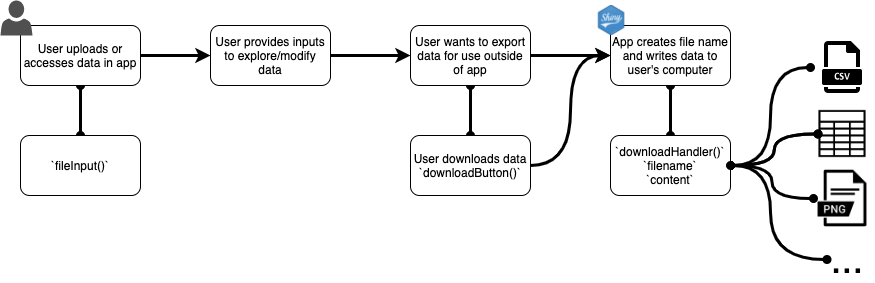
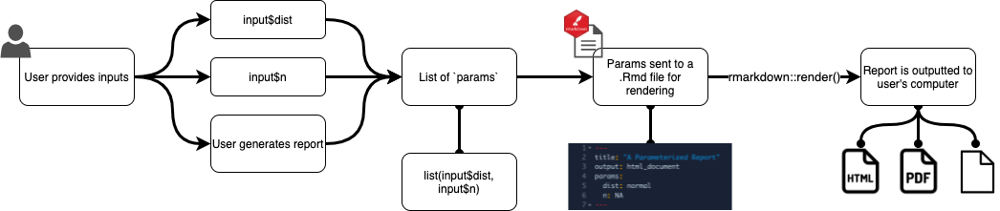

# Uploads and Downloads

**Learning objectives:**  

* Learn how to include file upload/download functionality into a Shiny application
* Implement the key UI components required to provide uploading/downloading functionality in an app
* Implement the key server components required to provide uploading/downloading functionality in an app
* Describe how the the UI and server elements fit together to provide this functionality
* Develop an app that validates the user's input from an upload
* Observe examples where uploading/downloading functionality is applied within a simple Shiny application

## File uploads

### UI

To upload a file use `fileInput(id, label)`. 

Some other arguments are:

- `multiple` - can multiple files be uploaded at once?
- `accept` - what file types are accepted? (character vector)
    - file extension: `.csv`, `.tsv`, `.rds`
    - MIME type: `application/JSON`, `image/png`
    - one of: `audio/*`, `video/*`, `image/*`
- Use `?fileInput` in console to learn more    
    
### Server

In the server, we work with a **data frame** with a special structure.
There are 4 columns:

- `name` - name of the file on user's computer
- `size` - file size in bytes. Default 5 MB; adjust with 
 `shiny.maxRequestSize` option.
- `type` - MIME type of the file
- `datapath` - file path on the server. Temporary.

## Uploading data

There are 2 things to note about uploading a data set.

- Use `req(input$file)` to make sure file is uploaded before code runs.
- Use `accept` argument to `fileInput()` to limit input types.
    - browser doesn't always enforce, so make sure to `validate()`
    
Example of uploading a data set and validating file type (from book):

```{r, eval = FALSE}
ui <- fluidPage(
  fileInput("file", NULL, accept = c(".csv", ".tsv")),
  numericInput("n", "Rows", value = 5, min = 1, step = 1),
  tableOutput("head")
)

server <- function(input, output, session) {
  data <- reactive({
    req(input$file)
    
    ext <- tools::file_ext(input$file$name)
    switch(ext,
      csv = vroom::vroom(input$file$datapath, delim = ","),
      tsv = vroom::vroom(input$file$datapath, delim = "\t"),
      validate("Invalid file; Please upload a .csv or .tsv file")
    )
  })
  
  output$head <- renderTable({
    head(data(), input$n)
  })
}
```

### Observe this in action

- Check out the `app-upload.R` example

### Use a break-point to observe what's going on here

- Add a breakpoint before the `switch()` function.
  - Examine `input$upload`
  - Examine `input$file$datapath` object
  - Examine `ext`
  - Import data in the interactive debugger

```{r eval=FALSE}
  data <- reactive({
    req(input$upload)
    
    ext <- tools::file_ext(input$upload$name)
#> Add a breakpoint here    
    switch(ext,
           csv = vroom::vroom(input$upload$datapath, delim = ","),
           tsv = vroom::vroom(input$upload$datapath, delim = "\t"),
           validate("Invalid file; Please upload a .csv or .tsv file")
           )
    
  })
```


## Downloads

### UI

- For file downloads, use `downloadButton(id, label)` or `downloadLink(id, label)`.
- Customize the appearance with the `class` or `icon` arguments.


### Server

In the server, use `downloadHandler(filename, content)`.
There are only 2 arguments, both are **functions**.

- `filename` - no arguments. Returns file name as a string.
- `content(file)` - one argument (`file`). Path to save the file.

```{r, eval = FALSE}
output$download <- downloadHandler(
  filename = function() {
    paste0(input$dataset, ".csv")
  },
  content = function(file) {
    write.csv(data(), file)
  }
)
```


## Downloading data

#### Diagram of data download functionality {-}


We can allow the user to download a file containing data based on their exploration of an application.

- provide functionality to download a tab separated file (e.g., `.csv`; `.tsv`)
- provide functionality to download any type of content (e.g., `png`)

### Observe this in action

- Check out the `app-download-data.R` example

## Downloading reports

#### Diagram of report download functionality {-}


We can allow the user to download a report based on their exploration of an
 application.
 
- parameterized R Markdown is a good way to do this
- potential parameters - filters, simulation parameters
- specify parameters in YAML header of R Markdown document
- **key idea** - call `rmarkdown::render()` from `content` argument of
 `downloadHandler()`
 
### Observe this in action

- Check out the `app-download-report.R` example

### Some tips & tricks when including report download functionality:

- `.Rmd` renders in working directory so copy file temporary directory before
 rendering.
- `.Rmd` renders in current R process so consider running in separate session
 with e.g. `callr` package.

## Meeting Videos

### Cohort 1

`r knitr::include_url("https://www.youtube.com/embed/o157ZBd0CUY")`

### Cohort 2

`r knitr::include_url("https://www.youtube.com/embed/SZIVWc91g-o")`

<details>
  <summary> Meeting chat log </summary>
  
```
00:51:00	Ryan Metcalf:	https://github.com/royfrancis/shinyapp_calendar_plot/blob/master/app.R
00:54:23	Ryan Metcalf:	https://pandoc.org/
```
</details>

### Cohort 3

`r knitr::include_url("https://www.youtube.com/embed/A08gd1X74GQ")`
