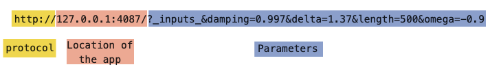

# Bookmarking


In brief, bookmarking addresses the issue of not being able to expose the current state of the app in its URL. Because of this, your Shiny app cannot be bookmarked or share a specific place with others.

**Learning objectives:**

+ Learn how to **add `bookmarkButton()`** to the UI

+ Learn how to **make the `ui` into a function** and understand why it is necessary

+ Learn how to use **`enableBookmarking='url'`** to the `shinyApp() call`

At the end of this chapter, you will be able to enable bookmarking for your app.

------------------------------------------------------

Introduction

1 - Modifying app to be bookmarkable 

2 - Breaking down generated URLs

3 - Updating the URL/Storing a richer state

4 - Bookmarking challenges

----------------------------------------------------------

## Introduction 

This chapter introduces the concept of bookmarking a Shiny app so that a user can conveniently return to a specific state of the app. 

As it it stands, Shiny apps are *single-page application (SPA)* - a web application or website that interacts with the user by dynamically rewriting the current web page with new data from the web server. This was one of the major drawbacks of employing Shiny apps. It is super inconvenient for you and your stakeholders to have to input the *exact* parameters in your application in order to produce the results you are trying to share. 

Now with bookmarking functionality, this problem is addressed.

The rest of this chapter is going to illustrate concepts using the Shiny application proposed in Exercise #1, which displays the results of `ambient::noise-simplex()`.

--------------------------------------------------------------

## Modifying app to be bookmarkable 

**There are three main parts you must modify in a Shiny app in order for it to be bookmarkable:**

1. In the `ui`: make it a function  
1. In the `ui`: add the `bookmarkButton()` function  
1. In the `shinyApp()` call: include `enableBookmarking = "url"` 

```{r demo_code, eval=FALSE}
ui <- function(request) {
  fluidPage(
    sidebarLayout(
      sidebarPanel(
        sliderInput("omega", "omega", value = 1, min = -2, max = 2, step = 0.01),
        sliderInput("delta", "delta", value = 1, min = 0, max = 2, step = 0.01),
        sliderInput("damping", "damping", value = 1, min = 0.9, max = 1, step = 0.001),
        numericInput("length", "length", value = 100),
        bookmarkButton()
      ),
      mainPanel(
        plotOutput("fig")
      )
    )
  )
}

shinyApp(ui, server, enableBookmarking = "url")
```

---------------------------------------

1. Making the `ui` a function  
    1. Why? Because Shiny needs to be able to modify the input controls specified by the URL. Like arguments are passed within a normal R function as parameters to produce different outputs, the `ui` now needs to take in an argument (the URL) in order to return the app into a particular state. The URL holds information on the input parameters that needs to be changed, hence why the `ui` now needs to be a function.

1. Adding the `bookmarkButton()` button to the app   
    1. This function adds a button to the `ui` that captures the current values of all the input controls and generates a URL from it. More on this later.

1. Adding `enableBookmarking = "url"` to the `shinyApp()` call
    1. This function ultimately puts the app together - the `ui` and the `server`. Adding this argument tells Shiny enable bookmarking and that the bookmark will be *URL-encoded* vs *saved-on-server*. More on this later  

-------------------------------------------

## Breaking down the URL


A default URL that is generated from within a Shiny app will look something like this:  
</br>

* `https://hadley.shinyapps.io/ms-bookmark-url/?_inputs_&damping=0.966&delta=1.25&length=100&omega=-0.54`

OR

* `http://127.0.0.1:4087/?_inputs_&damping=0.997&delta=1.37&length=500&omega=-0.9`

But what do all these words and numbers mean?




-----------------------------------------

## Updating the URL

It is probably more *convenient* to have the URL just update itself whenever inputs change instead of having the user press button each time a state must be captured. 

This can be accomplished by wrapping information like `input` values and `session` information around an observer as such:


```{r , eval=FALSE}
observe({
  reactiveValuesToList(input)
  session$doBookmark()
})
```


The `reactiveValuesToList(input)` step does what you might expect `as.list()` to do in base R. It takes the reactive object, `input` and stores its values and dependencies in a list.

The next step invokes the `doBookmark()` function from the session object. The session object is an environment that can be used to access information and functionality relating to the session. `doBookmark()` invokes the `onBookmarked()` *callback* function.

FYI: a callback function is: 

> a function that is passed as an argument to another function, to be “called back” at a later time. A function that accepts other functions as arguments is called a higher-order function, which contains the logic for when the callback function gets executed.


### Storing a richer state

URL bookmarking is simple and works everywhere you may want to deploy your Shiny app however, could become very long if you have a large number of inputs. If this is the case, it may be better to store your state on the server side.

Shiny saves the state of your app in an `.rds` file on the server and generates a shorter and easier URL. To do this, you can simply change the `enableBookmarking` argument to be "server" instead of "url"

```{r, eval=FALSE}
shinyApp(ui, server, enableBookmarking = "server")

```

This generates URLs like this: `http://127.0.0.1:4087/?_state_id_=0d645f1b28f05c97` 

The parameter in this instance is the `state_id` which corresponds to a directory in your working directory - `shiny_bookmarks/0d645f1b28f05c97`

⚠️ Be sure to have a mechanism to routinely delete these directories. If your app requires bookmarking in a complex state and you do not delete these files, your app is going to take up more disk space and may start to lag. However, when you *do* delete these files, their corresponding URLs will also stop working. Just be sure to either send updated links to stakeholders or be mindful of the state of your app.

-------------------------------------------------------------------

## Bookmarking Challenges

- You must be extra cautious if your app relies on random number generation. Bookmarking will not generate the same results unless you make your process reproducible.  
  - Suggested solution: `repeatable()` : returns a wrapped version of a random data function that always uses the same seed when called.  
  - `rnormA <- repeatable(rnorm)`
  
- Be sure to give your tabs an `id` when using `tabsetPanel()`

- Be cautious of what you share. If your app requires sensitive information, use `setBookmarkExclude()` somewhere in the `server` to ensure that they do not get included in your bookmark.  
  - `setBookmarkExclude(c("secret1", "secret2"))`
  
- If you use `reactiveValues()` to manually manage our reactive state, use `onBookmark()` instead of `onBookmarked()`. This will be discussed more in Ch.16 and more details can be found in [Advanced Bookmarking](https://shiny.rstudio.com/articles/advanced-bookmarking.html)


----------------------------------------------------------------------


## Meeting Videos

### Cohort 1

`r knitr::include_url("https://www.youtube.com/embed/OjLvTchubBY")`

<details>
  <summary> Meeting chat log </summary>
  
```
00:05:44	Russ Hyde:	Hi everyone
00:05:52	Federica Gazzelloni:	hello!
00:05:55	Russ Hyde:	Welcome to another week of Mastering Shiny
00:06:19	Anne:	Hello ;)
00:06:46	Russ Hyde:	Is anyone interested in taking over looking after Maya Gans' Mastering Shiny solutions manual?
00:06:56	Russ Hyde:	https://rfordatascience.slack.com/archives/C012R356GLC/p1619539252081100
00:14:14	Robert Overman:	SAS still is great when you need to plug and chug through a ton of data
00:22:54	Federica Gazzelloni:	we cannot hear
00:23:03	Federica Gazzelloni:	it is metallic
00:23:07	Federica Gazzelloni:	to me still
00:28:35	Anne:	could it be, that it has sth to do with the bookmark button?
00:31:44	Robert Overman:	I could see this being really useful when you are testing an app, bc then you don't have to check all of your options every time you run it to check for errors
00:47:45	Federica Gazzelloni:	Q -  have some questions!!!
01:03:56	Federica Gazzelloni:	thanks
```
</details>

### Cohort 2

`r knitr::include_url("https://www.youtube.com/embed/gB70zh1MkLk")`

<details>
  <summary> Meeting chat log </summary>
  
```
00:23:33	Conor Tompkins:	From the docs: “reduce() is an operation that combines the elements of a vector into a single value. The combination is driven by .f, a binary function that takes two values and returns a single value”
01:09:29	Conor Tompkins:	https://www.rplumber.io/
01:09:37	Conor Tompkins:	curl --data "a=4&b=3" "http://localhost:8000/sum"
01:13:18	Conor Tompkins:	https://cran.r-project.org/web/packages/curl/index.html
01:17:06	Conor Tompkins:	https://xkcd.com/327/
```
</details>

### Cohort 3

`r knitr::include_url("https://www.youtube.com/embed/rBGzD4v9qhc")`

<details>
  <summary>Meeting chat log</summary>
```
00:17:16	Brendan Lam:	https://shiny.rstudio.com/articles/advanced-bookmarking.html
00:24:09	Ryan Metcalf:	https://www.man7.org/linux/man-pages/man8/cron.8.html
00:25:07	Ryan Metcalf:	Keep in mind, this is only one solution for managing a web server using some type of “timing" service. The link is specific to a Linux server. There are alternatives from other hosting applications.
00:29:51	Brendan Lam:	https://mastering-shiny-solutions.org/bookmarking.html
```
</details>


<!--
### Cohort 4

`r knitr::include_url("https://www.youtube.com/embed/URL")`

<details>
  <summary>Meeting chat log</summary>
```
LOG
```
</details>
-->
