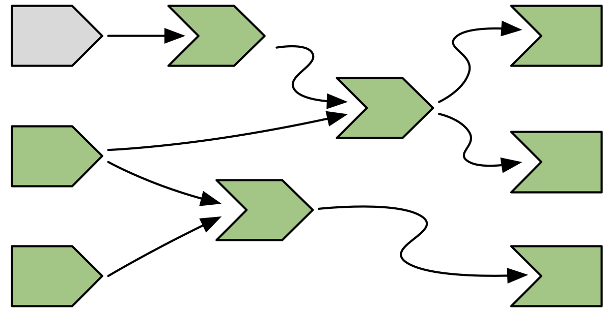

# The reactive graph

**Learning Objectives**

- Understand the reactive graph
- Learn the importance of invalidation
- Learn about the `reactlog` package

## Quick review of chapter 3 Basic reactivity {-}

 - Imperative (most of R) vs declarative (shiny)
 - Lazyness, only do what is necessary but could be difficult to debug
 - The reactive graph notation:  
 - Execution order is not top to bottom but determined by the reactive graph
 - Reactive expressions with `reactive()`
 - Observers with `observeEvent()`

## Reactive execution example (code) {-}

```{r, reactive-example, eval=FALSE}
ui <- fluidPage(
  numericInput("a", "Range mid point", value = 10),
  numericInput("b", "Sample size", value = 1),
  numericInput("c", "Times sample size", value = 1),
  br(),
  h4("Sampled data from the range"),
  plotOutput("x"),
  h4("Highest number in the sampled data"),
  tableOutput("y"),
  h4("Times sample size"),
  textOutput("z")
)

server <- function(input, output, session) {
  rng <- reactive(input$a * 2)
  smp <- reactive(sample(rng(), input$b, replace = TRUE))
  bc <- reactive(input$b * input$c)
  
  output$x <- renderPlot(hist(smp()))
  output$y <- renderTable(max(smp()))
  output$z <- renderText(bc())
}
```


## Reactive execution example (graphic) {-}

- Reactive producers
  - 3 reactive inputs
  
- Reactive consumers
  - 3 reactive expressions
  - 3 outputs


> *Reactivity is more accurately modelled in the opposite direction*

## A session begins {-}

- Shiny has no a priori knowledge of the **relationships between reactives**
- The consumers are **invalidated** (grey) as they haven't run yet.
- The producers are **available** (green) for computation


## Execution begins {-}

- Shiny **starts executing** (orange) ***any*** invalidated output.


## Reading a reactive expression {-}

- The reactive expression 
  - Starts **executing** (orange)
  - **Records** the relationship
- The output keeps executing


## Reading an input {-}

- This reactive expression happens to **read a reactive input**.
- Inputs don't need an execution phase.


## Reactive expression completes {-}

- The other reactive expression 
  - Starts **executing** (orange).
  - **Records** the relationship.
- Then a reactive expression happens to **read a reactive input**.
- Now that the reactive expression has **finished executing** (green).
- The reactive expression has **cached the result**.


## Output completes {-}

- The reactive expression has **returned** its value.
- The output can **finish executing** (green).


## The next output executes {-}

- Shiny chooses another to **execute** (orange).
- It starts reading values from reactive producers.
- Reactives behavior:
  - Complete returns their values immediately.
  - Invalidated kicks off their own execution graph.


## Outputs flushed {-}

- No more work will occur until some external force acts on the system.


## An input changes (1/3) {-}

1. Invalidating the input.



## An input changes (2/3) {-}

2. Notifying the dependencies.


## An input changes (3/3) {-}

3. Removing the existing connections.


## Rediscovering the relationships {-}

- To ensure that our graph stays accurate shiny needs **erase arrows when they become stale**


## Re-execution {-}

- Execute the invalidated outputs, one at a time, starting off
- Shiny will **rediscover** the relationships around these nodes as they re-execute.


## Exercises {-}

*1. Draw the reactive graph for the following server function and then explain why the reactives are not run.*

```r
server <- function(input, output, session) {
  sum <- reactive(input$x + input$y + input$z)
  prod <- reactive(input$x * input$y * input$z)
  division <- reactive(prod() / sum())
}
```


```{r}
#| message: false
#| warning: false
#| echo: false
#| eval: true

library(DiagrammeR)

grViz("
digraph reactive_graph_1 {

  # General properties
  graph [rankdir = LR, fontsize = 10, overlap = true]


  # Defining input nodes
  node [shape = cds,
        fontname = Helvetica,
        rank = 1]
  x; y; z
  
  subgraph {
  rank = same; x; y; z;
  }
  
  
  # Defining Reactive Expressions
  node [shape = box,
        fontname = Helvetica,
        height = 0.15]
  sum; prod; division


  # Defining output
  node [shape = circle,
        width = 0.5]
  

  # several 'edge' statements
  x -> sum
  y -> sum
  z -> sum
  x -> prod
  y -> prod
  z -> prod
  sum -> division
  prod -> division
}
")
```

**There are no outputs**. Server function only contains inputs and reactive expressions.


## Exercises {-}

*2. The following reactive graph simulates long running computation by using Sys.sleep().*


1.  Starting state is invalidated

2. The waiting times can be calculated via the reactive graph, but, for a *double check*, the following app confirms each waiting time:

```{r, eval=FALSE}
# Waiting times per reactive value
## x1: 1 second
## x2: 2 seconds
## x3: 1 second

library(shiny)

ui <- fluidPage(
  radioButtons("increaseVal", 
               "Increase selected reactive value by 1",
               inline = TRUE,
               choices = paste0("x", 1:3)
  )
)


server <- function(input, output) {
  x1 <- reactiveVal(1)
  x2 <- reactiveVal(2)
  x3 <- reactiveVal(3)
  
  y1 <- reactive({
    Sys.sleep(1)
    x1()
  })
  y2 <- reactive({
    Sys.sleep(1)
    x2()
  })
  y3 <- reactive({
    Sys.sleep(1)
    x2() + x3() + y2() + y2()
  })
  
  
  observe({
    # Print current minute and seconds
    print(paste("Starting time:", stringr::str_sub(Sys.time(), 15, 20)))
    print(y1())
    print(paste("y1 finished:", stringr::str_sub(Sys.time(), 15, 20)))
    print(y2())
    print(paste("y2 finished:", stringr::str_sub(Sys.time(), 15, 20)))
    print(y3())
    print(paste("y3 finished:", stringr::str_sub(Sys.time(), 15, 20)))
  })
  
  # When the user increases some reactive value
  observeEvent(input$increaseVal, {
    message(input$increaseVal)
    # Example: x1(isolate(x1()) +1)
    eval(parse(text = 
                 paste0(
                   input$increaseVal, 
                   "(isolate(",
                   input$increaseVal, 
                   "()) + 1)"
                 )
    ))
  })
}

shinyApp(ui, server)
```
    
## Exercises {-}

*3. What happens if you attempt to create a reactive graph with cycles?*

```r
x <- reactiveVal(1)
y <- reactive(x + y())
y()
```

When we start the session, `y` would not exist and thus `y()` would return an error since `y` is a reactive expression that consists of itself.

## Dynamism {-}

- Here the app you want to create.


## Dynamism {-}

- But you wrote this code.

```{r, eval=FALSE}
ui <- fluidPage(
  selectInput("choice", "A or B?", c("a", "b")),
  numericInput("a", "a", 0),
  numericInput("b", "b", 10),
  textOutput("out")
)

server <- function(input, output, session) {
  output$out <- renderText({
    if (input$choice == "a") {
      input$a
    } else {
      input$b
    }
  }) 
}
```


## Dynamism {-}

- So the real graph is:


## Dynamism {-}

- Use all the inputs before using the `if` statement.

```{r}
#| eval: false

output$out <- renderText({
  a <- input$a
  b <- input$b

  if (input$choice == "a") {
    a
  } else {
    b
  }
}) 
```


## The reactlog package {-}

- Draws every dependency even if there are **not currently active** with thin **dotted lines**:
  - They might be used in the past
  - They might be used in the future
  
- There are three additional reactive inputs
  - `clientData$output_x_height`
  - `clientData$output_x_width`
  - `clientData$pixelratio`

```{r, eval=FALSE}
options(shiny.reactlog = TRUE)
reactlog::reactlog_enable()
shiny::runApp("examples/14-the-reactive-graph/app.R")
```

Ctrl+F3 or Cmd+F3


## Summary {-}

Key concepts that were covered in the chapter:

- How the reactive graph operates
- Invalidation cycle
- reactlog package


## Meeting Videos

### Cohort 1

`r knitr::include_url("https://www.youtube.com/embed/kUMRnS-APlc")`

### Cohort 2

`r knitr::include_url("https://www.youtube.com/embed/8AK_qPbK4MA")`

<details>
  <summary> Meeting chat log </summary>
  
```
00:43:00	Ryan Metcalf:	Not sure if this quite answers the question of cache’ing variables in a Shiny Server -> UI handshake. The comment I made was toward “threading”. The article does clarify the differences. https://www.digitalocean.com/community/tutorials/apache-vs-nginx-practical-considerations
```
</details>

`r knitr::include_url("https://www.youtube.com/embed/q2d3uBHO3Tk")`

<details>
  <summary> Meeting chat log </summary>
  
```
00:37:01	Ryan Metcalf:	Really good topic on Linked List in C++. The discussion was related to memory management. https://www.geeksforgeeks.org/data-structures/linked-list/
00:45:12	Kevin Gilds:	Reactive Values in Modules
00:45:39	Kevin Gilds:	The inputs across across modules
00:47:27	Kevin Gilds:	I will put some articles in the slack reactive values and modules
```
</details>


### Cohort 3

`r knitr::include_url("https://www.youtube.com/embed/prc4_l2SIbw")`

<details>
  <summary>Meeting chat log</summary>
```
01:07:52	LUCIO ENRIQUE CORNEJO RAMÍREZ:	shiny:::plotOutput
01:07:59	LUCIO ENRIQUE CORNEJO RAMÍREZ:	is that it?
01:10:25	Federica Gazzelloni:	formals()
01:10:35	Federica Gazzelloni:	body()
01:10:41	Federica Gazzelloni:	environment()
01:11:02	Federica Gazzelloni:	typeof()
01:12:39	LUCIO ENRIQUE CORNEJO RAMÍREZ:	https://shiny.rstudio.com/articles/client-data.html
01:13:31	Federica Gazzelloni:	https://adv-r.hadley.nz/functions.html
01:13:33	LUCIO ENRIQUE CORNEJO RAMÍREZ:	session$clientData
01:15:44	Federica Gazzelloni:	shiny:::plotOutput
01:21:23	LUCIO ENRIQUE CORNEJO RAMÍREZ:	bye, thanks
```
</details>


### Cohort 4

`r knitr::include_url("https://www.youtube.com/embed/3kagToL-3ik")`


### Cohort 5

`r knitr::include_url("https://www.youtube.com/embed/URL")`

<details>
  <summary>Meeting chat log</summary>
```
LOG
```
</details>
