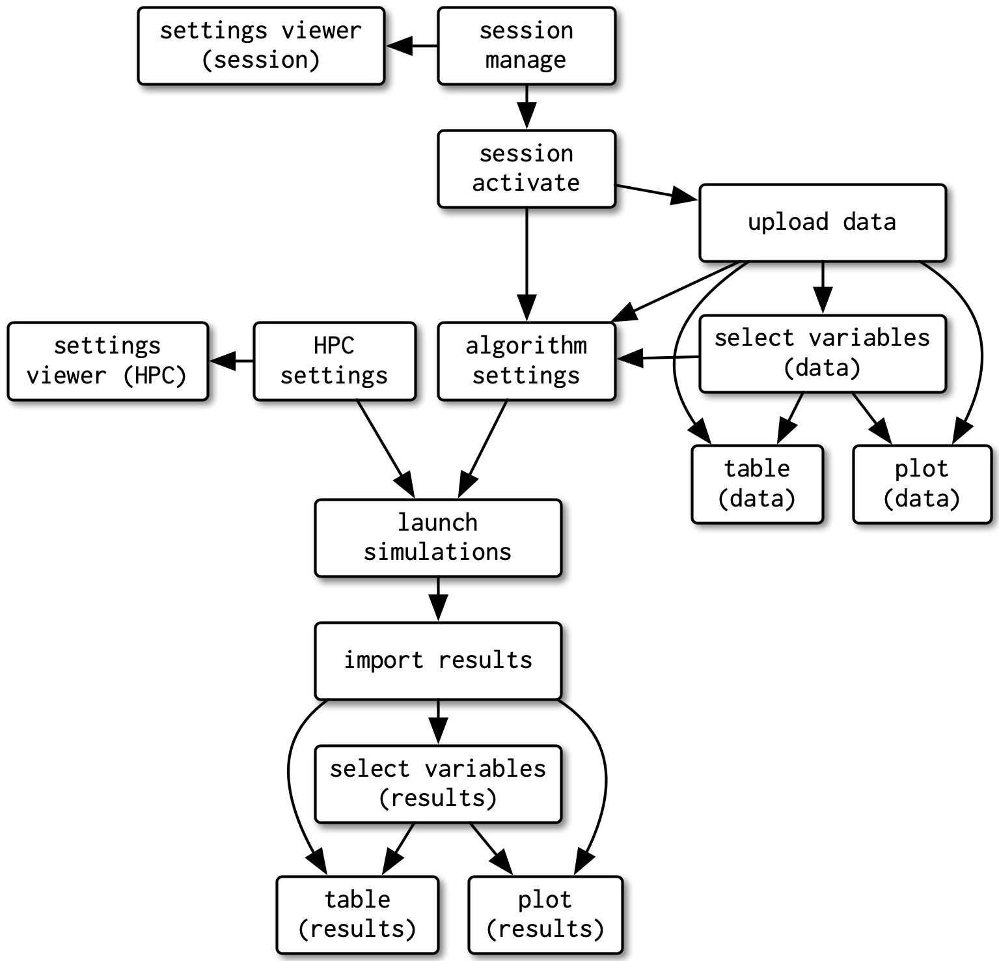
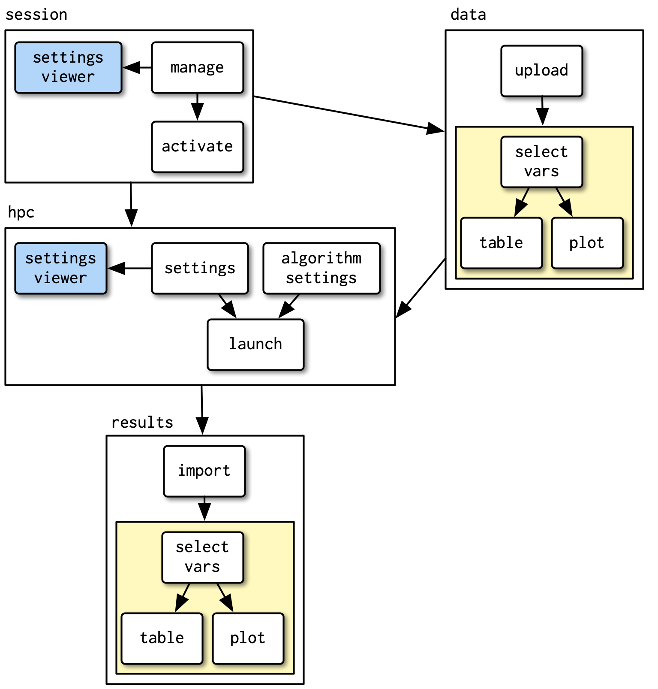

# Shiny modules

Functions work well if:

- All code is on the server side
- All code in on the client side

<br>

If the **server code relies** on specific structure in the **UI**

- Use **modules**

## Without modules {-}

We can end creating a really hard to mantain app.

{width=50% height=50%}

## Modules benefits {-}

Modules are a kind of **miniature app** within a larger app that isolate a particular group of **inputs and outputs** with a UI and a server part. 

- Avoid namespace collisions
- Allows encapsulate distinct app components
- Facilities collaboration

- **Modules works as functions for Shiny**.
  - Helps you break your big, complex app into smaller parts. 
  - Makes Shiny code more readable.
  - Makes Shiny code easier to debug.
  - Makes Shiny components reusable.
  - Opens the possibility to apply unit test.
  
  
## After implementing modules {-}

{width=50% height=50%}


## App 1: Before applying modules {-}

```{r, eval=FALSE}
ui <- fluidPage(
  selectInput("var", "Variable", names(mtcars)),
  numericInput("bins", "bins", 10, min = 1),
  plotOutput("hist")
)
server <- function(input, output, session) {
  data <- reactive(mtcars[[input$var]])
  output$hist <- renderPlot({
    hist(data(), breaks = input$bins, main = input$var)
  }, res = 96)
}
```

## App 1: UI function {-}

1. Create a function with the `id` argument.
2. Wrap all components in the `tagList` function to **bundle together multiple components** without actually implying how they’ll be laid out. 
3. Wrap each `inputId` using the next structure `NS(id, "id_name")`.

```{r, eval=FALSE}
histogramUI <- function(id) {
  tagList(
    selectInput(NS(id, "var"), "Variable", choices = names(mtcars)),
    numericInput(NS(id, "bins"), "bins", value = 10, min = 1),
    plotOutput(NS(id, "hist"))
  )
}
```

## App 1: UI using NS once {-}

From `shiny::NS()` documentation.

> If id is missing, returns a function that expects an id string as its only argument and returns that id with the namespace prepended. 

```{r eval=FALSE}
histogramUI <- function(id) {
  ns <- NS(id)
  tagList(
    selectInput(ns("var"), "Variable", choices = names(mtcars)),
    numericInput(ns("bins"), "bins", value = 10, min = 1),
    plotOutput(ns("hist"))
  )
}
```

## App 1: Module server {-}

1. Create a function with the ID argument.
2. Call the `shiny::moduleServer()` and pass the id and a **function that looks like a regular server function**.

**Note:** Thanks to that `id` the `shiny::moduleServer()` will be able to bring the **inputs** and **outputs** created in the UI function.

```{r eval=FALSE}
histogramServer <- function(id) {
  moduleServer(id, function(input, output, session) {
    data <- reactive(mtcars[[input$var]])
    output$hist <- renderPlot({
      hist(data(), breaks = input$bins, main = input$var)
    }, res = 96)
  })
}
```


## App 1: Module app {-}

We can create a custom function to validate that each modele is working.

```{r eval=FALSE}
histogramApp <- function() {
  ui <- fluidPage(
    histogramUI("hist1")
  )
  server <- function(input, output, session) {
    histogramServer("hist1")
  }
  shinyApp(ui, server)  
}
```

## App 1: Module app (Shinylive) {-}

<iframe height="500" width="100%" frameborder="no" src="https://shinylive.io/r/app/#code=NobwRAdghgtgpmAXGKAHVA6ASmANGAYwHsIAXOMpMAGwEsAjAJykYE8AKAZwAtaJWAlAB0IIgMQACALJEAJgFdqcTiJG9OpIgHNmMAKoBJCQB4AtBIBm8iAVK0S7WrIESQIiRIicT5gHIBlR2d3CVIoLQAZWg12EI9OOCVbAwhUeVJ2L1iwADcWITABXAkCgDUWWih6JQLigm4iWgJlCQBeT1hldhhSAhZOASK4z3l4RiaUtIysgvo+FULi2fnaiTzqeTg2iQBGAAZimD5tnaGIDw9UaiJSAHl0qczObPVSAsGQ4QgAX1UIV+0un8cEYORBPks1ls9ggQRcbnOEhgckUcGBoJBQWKVhsdgcfCmxSID3SxQSnE4MPhw1kUDCEMYcCg0LB3V6-WAwAJ6QAJHlGABdAVfC4SYmkKY814MiiyEEABWuGQRoo8r3YtLC7CKEiYTIA1t52tzSDy5l5DlBjsbUrz+SKLt9ioyjRIAJwANgd3y+v1E-skUit5zQqD+AJ0sAAgugITjoQ5qYj5LQ4xsnPLwnBYoi1dFNJH9AYXvmdu9PiEEhjGHGoXjYSaiSTSGTlJSSEnRRGgSCwYwSxoy4UQn74rx+DHUOwU63qy4Sj8-pIsNYJKHw-nAdH0NqwN8BUA"> </iframe>

## Modules isolation {-}

- `output$out` will never get updated because there is no input$bins
- The bins input can only be seen inside of the **hist1 module**.

```{r eval=FALSE}
ui <- fluidPage(
  histogramUI("hist1"),
  textOutput("out")
)
server <- function(input, output, session) {
  histogramServer("hist1")
  output$out <- renderText(paste0("Bins: ", input$bins))
}
```

## Modules conventions {-}

- `R/histogram.R` holds all the code for the module.

- `histogramUI()` is the module UI. If it’s used primarily for input or output I’d call it `histogramInput()` or `histogramOuput()` instead.

- `histogramServer()` is the module server.

- `histogramApp()` creates a complete app for interactive experimentation and more formal testing.

## Exercise 1 {-}

**Why is it good practice to put a module in its own file in the R/ directory? What do you need to do to make sure it’s loaded by your Shiny app?**

- I makes easier to transform the shiny app in to a package, as all the functions in a R package are store in the R/ folder.

- We will need to `source()` each of the modules.

```{r eval=FALSE}
sourceDir <- function(path, trace = TRUE, ...) {
    op <- options(); on.exit(options(op)) # to reset after each
    for (nm in list.files(path, pattern = "[.][RrSsQq]$")) {
       if(trace) cat(nm,":")
       source(file.path(path, nm), ...)
       if(trace) cat("\n")
       options(op)
    }
}
```

## Exercise 2 {-}

**The following module UI includes a critical mistake. What is it and why will it cause problems?**

```{r, eval=FALSE}
histogramUI <- function(id) {
  tagList(
    selectInput("var", "Variable", choices = names(mtcars)),
    numericInput("bins", "bins", value = 10, min = 1),
    plotOutput("hist")
  )
}
```

## Exercise 2 {-}

We need to use the `shiny::NS()` function to define the ids.

```{r, eval=FALSE}
histogramUI <- function(id) {
  ns <- NS(id)
  tagList(
    selectInput(ns("var"), "Variable", choices = names(mtcars)),
    numericInput(ns("bins"), "bins", value = 10, min = 1),
    plotOutput(ns("hist"))
  )
}
```


## Exercise 3 {-}

**The following module generates a new random number every time you click go:**

```{r eval=FALSE}
randomUI <- function(id) {
  tagList(
    textOutput(NS(id, "val")),
    actionButton(NS(id, "go"), "Go!")
  )
}

randomServer <- function(id) {
  moduleServer(id, function(input, output, session) {
    rand <- eventReactive(input$go, sample(100, 1))
    output$val <- renderText(rand())
  })
}
```

## Exercise 3 {-}

**Create an app that displays four copies of this module on a single page. Verify that each module is independent.**

```{r eval=FALSE}
ui <- fluidPage(
    randomUI("num1"),
    randomUI("num2"),
    randomUI("num3"),
    randomUI("num4")
)

server <- function(input, output, session) {
    randomServer("num1")
    randomServer("num2")
    randomServer("num3")
    randomServer("num4")
}

shinyApp(ui, server)  
```

## Exercise 3 (Shinylive) {-}

<iframe height="500" width="100%" frameborder="no" src="https://shinylive.io/r/app/#code=NobwRAdghgtgpmAXGKAHVA6ASmANGAYwHsIAXOMpMAGwEsAjAJykYE8AKAZwAtaJWAlAB0IIgMQACALJEAJgFdqcTiJHMIsojACqASQkAeALQSAZvIgFStEu1qyBEkCIkTSUAOYAZWp1LsXVzc4AA9SAHl5UlQo9gA5AGU7WVwJITAANyhqdIEBXEDXKCsbCAAhKNJbROTU9I8iXLqwAHEiAEJcwOEIAF81KA0tBLhGDNHDE3NLa1t7R2cIVxg5RTgRsdHaswsSuYgY0lSiKMPUzmVOUoXCiXVZSYk4cbIsOGLrcbsDqIASBvOsFQSnYAEYAAzg1KgvK3E7RP5ZaiPRgUWSjAAqoX893YsKWEl6PX6olJkikUD4EjQqFUEHktEepmoDNkAAVPHAAgTXPctHoApB5DBQU1bnydLpBfSYAAmMU8u6DTSS6XCgDMCqCSqGqvSMoALF0ID0RBdNowmbtZhBvmcJPD7RdOFcSDdFRKNuNGGqRcbtZ7Rt7ffKwD0A8rhkGtvqNf6goGLb6jWGRCSzbx+ABBdDsBnnaOMRxpCBgXoAXSAA"> </iframe>

## Exercise 3 {-}

**How could you change the return value of randomUI() to make the display more attractive?**

1. Placing the Go button before the returned values.
2. Use `bslib::value_box()`.

```{r eval=FALSE}
randomUI <- function(id, title) {
  ns <- NS(id)
  tagList(
    actionButton(ns("go"), "Go!"),
    value_box(title = title,
              value = textOutput(ns("val"))
    )
  )
}
```

## Exercise 3 {-}

**How could you change the return value of randomUI() to make the display more attractive?**

3. Changes the layout to show a grid.

```{r eval=FALSE}
ui <- page_fluid(
  layout_column_wrap(
    width = 1/2, height = 450,
    randomUI("num1", "Number 1"), 
    randomUI("num2", "Number 2"), 
    randomUI("num3", "Number 3"),
    randomUI("num4", "Number 4")
  )
)
```

## Exercise 3 (Shinylive) {-}

<iframe height="500" width="100%" frameborder="no" src="https://shinylive.io/r/app/#code=NobwRAdghgtgpmAXGKAHVA6ASmANGAYwHsIAXOMpMAGwEsAjAJykYE8AKAZwAtaJWAlAB0IdJiw71OY4RBEBiAAQBZIgBMArtTicRI5hDVEYAVQCSigDwBaRQDMNEAqVol2tNbkUvS2gYpARRUUITitbADkAZXc1WWDSKABzABlaTlJ2IODFKGdXCAAhDVJSN1CssCSiITABL1qAcSIAQlr67OCANyhqDTgAfXoiAA92H21FAF5vWl84XE6c5eWevrhp7zgR0gB5EtQS9gratfb4nIvZAF89CAMjGCi4Ri6X8PtHfLcPf0CIYIwdRaODPV4vWJeBxOFw-CCHUheIgHEpeTg6TgFP5LB4fOBvMhYOB5FxvdzwkoAEmqaNgqG07AAjAAGZleRkCC7BZGkBGUtYfRgUNQvAAq20yD3YnOy1xudwUKigfFy6DuGloH1QyUGdj6HiyAMU1CgrB5A2IfRgEAGAHdmKhDctbR5SNxNoyAPQAJi83DgtCS3FImwALABWNk4qCGYzmSoQDQwRm1BpgCJJ+jvFN1BpG4IPONmBNJ72pxS1DMwLOMRRl3MV-OKQumYu1RMwADM5crmfe3dz0djrZLMFDPfTfdr47q2VkshE6PBtZsnxhBXJCKRKMRinRnExJGxRpbYLejFHOYup5e59H9evMceZ4h7aTA8fw5fF7fY-aIluORQl4fgAEF0HYDU0VvF5-EbMBrgAXSAA"> </iframe>

## Inputs and outputs {-}

- **Adding arguments to the module UI** gives greater control over module appearance.

- **Connecting modules together** requires you to be explicit about inputs and outputs for the module server.
  - Much easier to understand
  - Allows you to build substantially more complex apps
  
  
## App 2: Select data (UI) {-}

Allows the user to select a dataset after confirming if the data is data.frame (`filter = is.data.frame`) or a matrix (`filter = is.matrix`)

limit the options to built-in datasets that are either data frames

```{r eval=FALSE}
datasetInput <- function(id, filter = NULL) {
  names <- ls("package:datasets")
  if (!is.null(filter)) {
    data <- lapply(names, get, "package:datasets")
    names <- names[vapply(data, filter, logical(1))]
  }
  
  selectInput(NS(id, "dataset"), "Pick a dataset", choices = names)
}
```

## App 2: Select data (SERVER) {-}

The module server uses `get()` to retrieve the dataset return a **reactive value** rather than defining some *output*.

```{r eval=FALSE}
datasetServer <- function(id) {
  moduleServer(id, function(input, output, session) {
    reactive(get(input$dataset, "package:datasets"))
  })
}
```

## App 2: Select data (APP) {-}

Now, in the module app we need to **capture its return** value with `<-`.

```{r eval=FALSE}
datasetApp <- function(filter = NULL) {
  ui <- fluidPage(
    datasetInput("dataset", filter = filter),
    tableOutput("data")
  )
  server <- function(input, output, session) {
    data <- datasetServer("dataset")
    output$data <- renderTable(head(data()))
  }
  shinyApp(ui, server)
}
```

## App 2: Select data (Shinylive) {-}

<iframe height="500" width="100%" frameborder="no" src="https://shinylive.io/r/app/#code=NobwRAdghgtgpmAXGKAHVA6ASmANGAYwHsIAXOMpMAGwEsAjAJykYE8AKAZwAtaJWAlAB0IIgCZRSUTnFIBJCKgCupAAQAeALSqAZkogFStEu1pjcu2tXKNVAXlUA5AKoAZVwNUgRq1dHicGtrUnOxCYKhQBADWUADmcIgSUjKknOHCEL60OqrsAIS0nBgQStTU7DpWNgKe3lm+qslQQarUaKjUHP5wnBYJpBbhkTHxic2p6WCZjX6wva09nMAAbh1d7M0WVdZwjBbURHG0BFAVAIy1ALo+qgC+t7cy1HCGCsqk7I4AyqbmquEJrIMkMwAAFE7RVQtIGkcIWAjcIgnBYOJaZB6iCCw757FZ7Vp6AxGExmOq3GBEMRlOC4xj4xh-bb6QzGCCmRQqCxEFQfCwyTicNnkhq+RhwKJGfHsAYcj4AElhoJGsQSSUk0lkU1qtzuGJE4g1qQAguhCSySeydjZ7E43B4vLclLRCdRnWIwWMwqKmkbZO8VGEwLD4ZZdrYHNa9gJcLdfFJ6C8APK8wOAjUZW4zVQyekErS6C1suVc1Q80h8nO9IUkEWzZqtHF4vZBkPTONl1OkRUa1ri7F7AAqUETcHY3AlYk2GvYtWzmN8PD4rFNqHYzv5zcY+qxsNXpmKMEkjFoAA8BGA7lcgA"> </iframe>

## App 2: Extracting a numeric variable (UI) {-}

create a control that allows the user to select variables of specified type from a given reactive dataset.

```{r eval=FALSE}
selectVarInput <- function(id) {
  selectInput(NS(id, "var"), "Variable", choices = NULL) 
}
```


## App 2: Extracting a numeric variable (SERVER) {-}

1. Create a function to list all columns that meet the condition passed to the `filter` argument as a function.

```{r eval=FALSE}
find_vars <- function(data, filter) {
  names(data)[vapply(data, filter, logical(1))]
}
```

2. Update the select input element in the UI with columns that meet the condition and extract the selected column from the reactive dataset.

```{r eval=FALSE}
selectVarServer <- function(id, data, filter = is.numeric) {
  
  moduleServer(id, function(input, output, session) {
    
    observeEvent(data(), {
      updateSelectInput(session, "var", choices = find_vars(data(), filter))
    })
    
    reactive(data()[[input$var]])
  })
  
}

```

## App 2: Extracting a numeric variable (APP) {-}

```{r eval=FALSE}
selectVarApp <- function(filter = is.numeric) {
  
  ui <- fluidPage(
    datasetInput("data", is.data.frame),
    selectVarInput("var"),
    verbatimTextOutput("out")
  )
  
  server <- function(input, output, session) {
    data <- datasetServer("data")
    var <- selectVarServer("var", data, filter = filter)
    output$out <- renderPrint(var())
  }
  
  shinyApp(ui, server)
  
}
```


## App 2: Extracting a numeric variable (Shinylive) {-}

<iframe height="500" width="100%" frameborder="no" src="https://shinylive.io/r/app/#code=NobwRAdghgtgpmAXGKAHVA6ASmANGAYwHsIAXOMpMAYgAIAZASwCMAnKVxuAZ1tKNoBXbnAA6EADYt2rAJ4AKbgAtGEWQEpxWiHQDKcCXAKlaAESikotAGLt42gCYWoI0gEkIqQSYA8AWloAM0EIY0YSeUYHXCDGCXJWWgBeWgA5AFV6enVaEHFaWmh4Xn9aCW55UTBUKAIAaygAczhEJ0tXbirNCALGQNp5AEJGbgwIQQkJeUC4hPUcvJ6C2jarUok0VAkFIp4Y5tIYqpr6ppbVjq785d2SgNvgADdN7flVmJn4uFYYiSJGxgEKBTACM8wAutcAL7Xa4iQzGDxeUjyVK6SLRWhVC5wUhdI5gAAKgLqtCsOLxeFoBCUREBPGShVgPG6MIg4gp+lYj2+tFKwVCpHCEAxC2uMCIDgmcC5PNYGI+ITCEVUyJiRG8atoIm43GFYqWBVYcFqQp58gOkU83gAJBSCScGs1Ws5LmB5tDWdpxHoDEYTKlBPBOARaABhIgSIPsmPw-0ANQ4SO8fICAuVIqiBoKccR1pRaIVWLAz1Y+OLic4UGYhiqMRpdIIDJSGSyOXEbPEMwgDgA+qW7kElUKIu9Yl9WNmmcU3s51E8Xgox58Er9-oDgfIwepIRBOxBc6RK7Lefzh8Ki8vZryUiMxkHvoCpxKpYYT-KoorBRfVd51Zq-21Hg9RIKcCiIZgRG5OAAFEeTIWdLHkdQYkWZZlkEVA2hlP082RRRgOFAlSzralaXpXgUm7PsB0QqBkI+a9J26dCoRY5ZriNE0wnNVZkOAYBf1IG1S3BcF2LYjtvR0cNjQsVRGjJdBtEPSsAEF0FTIdvwiFcb1oO9xmDJ9clhJZBEYLTAijKJCTOSpDRWV1cWTFFsWcUi71WDBAjsOAUM4oCESPJN80qEsOHxQK5WYeSYAAFTgAAPUgAHkALcsANUpdj2Lhb45Ss88VXzf9SC1HUQIgMCnMsLTOQK75wtWK5HNLLTVI4d9wpIqkrwnRk9MnQLsuRG1sq040e2+QlOAQ0tkIksycxUNQNNQeQLJiKC5TyvdpLoLAQggBSlNQFTcJC1h1uQsAoXBIA"> </iframe>

## Tip: Validate if reactive {-}

**Check that each input to your module is either reactive or constant** 

1. Makes the life of module user much easier.
2. Avoids a common problem when mixing modules with other input controls.

*Sometimes the solution can be wraping the value* in the `reactive()` function like `selectVarServer("var", reactive(input$x))`.

## Tip: Validate if reactive {-}

```{r eval=FALSE}
selectVarServer <- function(id, data, filter = is.numeric) {
  stopifnot(is.reactive(data))
  stopifnot(!is.reactive(filter))
  
  moduleServer(id, function(input, output, session) {
    observeEvent(data(), {
      updateSelectInput(session, "var", choices = find_vars(data(), filter))
    })
    
    reactive(data()[[input$var]])
  })
}
```

## Tip: Validate the input of each argument {-}

**Debugging Shiny apps is a little harder than debugging regular R code**.

```{r eval=FALSE}
find_vars <- function(data, filter) {
  stopifnot(is.data.frame(data))
  stopifnot(is.function(filter))
  names(data)[vapply(data, filter, logical(1))]
}
```

## App 3: Modules consolidation (UI) {-}

We could combine the `dataset` and `selectVar` modules in single one. 

```{r, eval=FALSE}
selectDataVarUI <- function(id) {
  tagList(
    datasetInput(NS(id, "data"), filter = is.data.frame),
    selectVarInput(NS(id, "var"))
  )
}
```

## App 3: Modules consolidation (SERVER) {-}

We could combine the `dataset` and `selectVar` modules in single one. 

```{r eval=FALSE}
selectDataVarServer <- function(id, filter = is.numeric) {
  moduleServer(id, function(input, output, session) {
    data <- datasetServer("data")
    var <- selectVarServer("var", data, filter = filter)
    var
  })
}
```


## App 3: Modules consolidation (APP) {-}

```{r eval=FALSE}
selectDataVarApp <- function(filter = is.numeric) {
  ui <- fluidPage(
    sidebarLayout(
      sidebarPanel(selectDataVarUI("var")),
      mainPanel(verbatimTextOutput("out"))
    )
  )
  server <- function(input, output, session) {
    var <- selectDataVarServer("var", filter)
    output$out <- renderPrint(var(), width = 40)
  }
  shinyApp(ui, server)
}
```


## App 3: Modules consolidation (Shinylive) {-}

<iframe height="500" width="100%" frameborder="no" src="https://shinylive.io/r/app/#code=NobwRAdghgtgpmAXGKAHVA6ASmANGAYwHsIAXOMpMAYgAIAZASwCMAnKVxuAZ1tKNoBXbnAA6EADYt2rAJ4AKbgAtGEWQEpxWiHQDKcCXAKlaAESikotAGLt42gCYWoI0gEkIqQSYA8AWloAM0EIY0YSeUYHXCDGCXJWWgBeWgA5AFV6enVaEHFaWmh4Xn9aCW55UTBUKAIAaygAczhEJ0tXbirNCALGQNp5AEJGbgwIQQkJeUC4hPUcvJ6C2jarUok0VAkFIp4Y5tIYqpr6ppbVjq785d2SgNvgADdN7flVmJn4uFYYiSJGxgEKBTACM8wAutcAL7Xa4iQzGDxeUjyVK6SLRWhVC5wUhdI5gAAKgLqtCsOLxeFoBCUREBPGShVgPG6MIg4gp+lYj2+tFKwVCpHCEAxC2uMCIDgmcC5PNYGI+ITCEVUyJiRG8atoIm43GFYqWBVYcFqQp58gOkU83gAJBSCScGs1Ws5LmB5tDWdpxHoDEYTKlBPBOARaABhIgSIPsmPw-0ANQ4SO8fICAuVIqiBoKccR1pRaIVWLAz1Y+OLic4UGYhiqMRpdIIDJSGSyOXEbPEMwgDgA+qW7kElUKIu9Yl9WNmmcU3s51E8Xgox58Er9-oDgfIwepIRBOxBc6RK7Lefzh8Ki8vZryUiMxkHvoCpxKpYYT-KoorBRfVd51Zq-21Hg9RIKcCiIZgRG5OAAFEeTIWdLHkdQYkWZZlkEVA2hlP082RRRgOFAlSzralaXpXgUm7PsB0QqBkI+a9J26dCoRY5ZriNE0wnNVZkOAYBf1IG1S3BcF2LYjtvR0cMSG4SMogsOBaBfaVOljXDSHMSxK3SNxUyHb8VQcKdLEaJhuBRTiVldXFkwLdFP2LVZyxXG9aDvVYMECOw4BQ6zD0rezUUczEqhI912K9A9NO0qBj2+OUDPTEdM0xNzElvUZxmDJ9cnFSVpXfIsUp-fN-1ILUdRAiAwJsywDM5RLvkqMAXPdazSwMwKOGK8KOFIq8J0ZDL2IKEilkkvdpLoMNjQsVRGjJdBtEPOLKwAQXQZLzwiDLGTvHLHwIKdBEYZKoyiQkzkqQ1tSiOBmA4egoFkDUrLunMHqe1hrogAwCIRLTnF0txWoi+ZcGsgoYCgVQ-oBuUnqFGAABU4AAD1IAB5ACrLAd6ujG2gorhZrEjPIzM3K2h3qqwjQPyu6utKNaQd68nwYGqlRusunbXegzjR7b5CU4BDSwY2gAHcolIJRGQAFgABgkuEVDULbUHkM6YiguVou0OgsBCCBFuW1BVti9nWC15CwChcEgA"> </iframe>

## Tip: Modules challenge {-}

Modules functions must be:

- Flexible enough to be used in multiple places.
- Simple enough that they can easily be understood.

***Expect that you’ll have to do it wrong quite a few times before you get it right.*** 

## App 4: Bind and Histogram (UI) {-}

We can create a module to define the number of bins and display the histogram.

```{r eval=FALSE}
histogramOutput <- function(id) {
  tagList(
    numericInput(NS(id, "bins"), "bins", 10, min = 1, step = 1),
    plotOutput(NS(id, "hist"))
  )
}
```

## App 4: Bind and Histogram (SERVER) {-}

Using two reactive arguments:

- `x` as the variable to plot
- `title` for the histogram

```{r eval=FALSE}
histogramServer <- function(id, x, title = reactive("Histogram")) {
  stopifnot(is.reactive(x))
  stopifnot(is.reactive(title))
  
  moduleServer(id, function(input, output, session) {
    output$hist <- renderPlot({
      req(is.numeric(x()))
      main <- paste0(title(), " [", input$bins, "]")
      hist(x(), breaks = input$bins, main = main)
    }, res = 96)
  })
}
```

## App 4: Reusing modules (APP) {-}

```{r eval=FALSE}
histogramApp <- function() {
  ui <- fluidPage(
    sidebarLayout(
      sidebarPanel(
        datasetInput("data", is.data.frame),
        selectVarInput("var"),
      ),
      mainPanel(
        histogramOutput("hist")    
      )
    )
  )
  
  server <- function(input, output, session) {
    data <- datasetServer("data")
    x <- selectVarServer("var", data)
    histogramServer("hist", x)
  }
  shinyApp(ui, server)
} 
```

## App 4: Reusing modules (Shinylive) {-}

<iframe height="500" width="100%" frameborder="no" src="https://shinylive.io/r/app/#code=NobwRAdghgtgpmAXGKAHVA6ASmANGAYwHsIAXOMpMAYgAIAZASwCMAnKVxuAZ1tKNoBXbnAA6EADYt2rAJ4AKbgAtGEWQEpxWiHQDKcCXAKlaAESikotAGLt42gCYWoI0gEkIqQSYA8AWloAM0EIY0YSeUYHXCDGCXJWWgBeWgA5AFV6enVaEHFaWmh4Xn9aCW55UTBUKAIAaygAczhEJ0tXbirNCALGQNp5AEJGbgwIQQkJeUC4hPUcvJ6C2jarUok0VAkFIp4Y5tIYqpr6ppbVjq785d2SgNvgADdN7flVmJn4uFYYiSJGxgEKBTACM8wAutcAL7Xa4iQzGDxeUjyVK6SLRWhVC5wUhdI5gAAKgLqtCsOLxeFoBCUREBPGShVgPG6MIg4gp+lYj2+tFKwVCpHCEAxC2uMCIDgmcC5PNYGI+ITCEVUyJiRG8atoIm43GFYqWBVYcFqQp58gOkU83gAJBSCScGs1Ws5LmB5tDWdpxHoDEYTKlBPBOARaABhIgSIPsmPw-0ANQ4SO8fICAuVIqiBoKccR1pRaIVWLAz1Y+OLic4UGYhiqMRpdIIDJSGSyOXEbPEMwgDgA+qW7kElUKIu9Yl9WNmmcU3s51E8Xgox58Er9-oDgfIwepIRBOxBc6RK7Lefzh8Ki8vZryUiMxkHvoCpxKpYYT-KoorBRfVd51Zq-21Hg9RIKcCiIZgRG5OAAFEeTIWdLHkdQYkWZZlkEVA2hlP082RRRgOFAlSzralaXpXgUm7PsB0QqBkI+a9J26dCoRY5ZriNE0wnNVZkOAYBf1IG1S3BcF2LYjtvR0WgAAkRn4Ro7FoF9tBUbhFLsAB5ADfDTc8VQcKdLEaJgNMqQ1CgfENkwLdFP2LZhVE6d0CScg9SJBAAGGIYFURkQRiDS4FQAKUM42gtiIUgdNIfDCwcqp1MpD0li9GNkv+Ox31TIdv0MmIAA8YiFUhDEZY1TUYc0qnkjSstgLop3q1A+ggaLIlGSqeLgeRCtSnN+FawJ2pRO9urNXrSsMAasSWF9pXfIt0xHTN83-OLAJ1ECIDA2gNU24Tkty40e2+Qk-hRND0NoY0AEdOvvYNAT65DZvQmAoH80oamCrz5Gm3qUOLWhgFIoSbXc7gCUhd0IoKZLXuBtgTTqSjaAhqHfK+noUk+1R2IKKEYmNdGAE4ADYJPS7Q6DDSqhQgRoyXQNSFIamAAEF0FylaLynQRGF5qMokJM4LPQvUHDgZgOHoKBZAOiWbqlmWODFiADGVm6VldXFbMqMBVnB0ZVgwQI7DgcLLMl3CjyTfNDZI1z4doa2dfxiANa112EfZpTYFi-CkoUrp0Ndwm3eudi4W+OVeYMtatQOrVtv1XIItWXLOTj75DeNuHLMK3LD2PXP5SqZ2YlWSPMoDmAlpDjTSP66E4RUNRudQeRBaC8uaZjOgsBCCBVGZzY2fq+uu+QsAoXBIA"> </iframe>

## Tip: Spitting Module UI {-}

It will give to separate elements in the UI depending of the **same server module**.

```{r eval=FALSE}
histogramOutputBins <- function(id) {
  numericInput(NS(id, "bins"), "bins", 10, min = 1, step = 1)
}
histogramOutputPlot <- function(id) {
  plotOutput(NS(id, "hist"))
}
```

## Tip: Spitting Module UI {-}

Please note that both functions are using the **same id**.

```{r eval=FALSE}
ui <- fluidPage(
  sidebarLayout(
    sidebarPanel(
      datasetInput("data", is.data.frame),
      selectVarInput("var"),
      histogramOutputBins("hist")
    ),
    mainPanel(
      histogramOutputPlot("hist")
    )
  )
)
```


## Tip: Spitting Module UI (Shinylive) {-}

<iframe height="500" width="100%" frameborder="no" src="https://shinylive.io/r/app/#code=NobwRAdghgtgpmAXGKAHVA6ASmANGAYwHsIAXOMpMAYgAIAZASwCMAnKVxuAZ1tKNoBXbnAA6EADYt2rAJ4AKbgAtGEWQEpxWiHQDKcCXAKlaAESikotAGLt42gCYWoI0gEkIqQSYA8AWloAM0EIY0YSeUYHXCDGCXJWWgBeWgA5AFV6enVaEHFaWmh4Xn9aCW55UTBUKAIAaygAczhEJ0tXbirNCALGQNp5AEJGbgwIQQkJeUC4hPUcvJ6C2jarUok0VAkFIp4Y5tIYqpr6ppbVjq785d2SgNvgADdN7flVmJn4uFYYiSJGxgEKBTACM8wAutcAL7Xa4iQzGDxeUjyVK6SLRWhVC5wUhdI5gAAKgLqtCsOLxeFoBCUREBPGShVgPG6MIg4gp+lYj2+tFKwVCpHCEAxC2uMCIDgmcC5PNYGI+ITCEVUyJiRG8atoIm43GFYqWBVYcFqQp58gOkU83gAJBSCScGs1Ws5LmB5tDWdpxHoDEYTKlBPBOARaABhIgSIPsmPw-0ANQ4SO8fICAuVIqiBoKccR1pRaIVWLAz1Y+OLic4UGYhiqMRpdIIDJSGSyOXEbPEMwgDgA+qW7kElUKIu9Yl9WNmmcU3s51E8Xgox58Er9-oDgfIwepIRBOxBc6RK7Lefzh8Ki8vZryUiMxkHvoCpxKpYYT-KoorBRfVd51Zq-21Hg9RIKcCiIZgRG5OAAFEeTIWdLHkdQYkWZZlkEVA2hlP082RRRgOFAlSzralaXpXgUm7PsB0QqBkI+a9J26dCoRY5ZriNE0wnNVZkOAYBf1IG1S3BcF2LYjtvR0WgAAkRn4Ro7FoF9tBUbhFLsAB5ADSAAIVUQd0xHTMHCncZg0BZMC3RT9i2YQzyyqByD1IkEAAYYhgVRGRBGINLgVBfK9GN1M02AdNIZFCT+Xw03PFUzNya4tiIUhIvwws7KqMKuhC8Qwv+Ox31TIdv0SmIAA8YiFUhDEZY1TUYc0qnkjSitgPLkqWdrUD6CA0siUZGp4uB5Eqj0ev4PrAgGlE7xGs0xtqwxJoKcVJWld8i2Mn983-KLAJ1ECIDA2gNUO4SwtK40e2+GLBrQ9DaGNABHIb70sghxuQtbnpgKAfNKGoAvc+QVrGlDi1oYBSKEm0XO4AlIXdTjljCn6obYE06ko2h4cRrzAZ6FIAdUdiCihGJjTxgBOAA2CT8pjOgw0aoUIEaMl0DUhSOpgABBdBSt2iIp3EQRGBFqMokJM5Kh6qI4GYDh6CgWQLoV9C9QcZWODliADC156KWsyowFWOHRlWDBAjsOAULRnNcKPJN83Nkj3VwJ3aEKpSIt0gyD3N3LUcNWhHfDsmIANo2fb97TdIelEcoUq5w-Y7p2Lhb45RFhLM3287dP8wjQO69DVlKzlc++c3LbD9DKtKw9j1r+Uqk9mJVgp32+f9mBttTjTSIm6E4RUNQhdQeRJdL6DJykmMfVoLAQggVQuc2Xn2oH6fkLAKFwSAA"> </iframe>


## Tip: Multiple output (SERVER) {-}

To solve this  problem you just need to wrap all your outputs in a `list()`.

Now we can change the title of the histogran.

```{r eval=FALSE}
selectVarServer <- function(id, data, filter = is.numeric) {
  stopifnot(is.reactive(data))
  stopifnot(!is.reactive(filter))
  
  moduleServer(id, function(input, output, session) {
    observeEvent(data(), {
      updateSelectInput(session, "var", choices = find_vars(data(), filter))
    })
    
    list(
      name = reactive(input$var),
      value = reactive(data()[[input$var]])
    )
  })
}
```

## Tip: Multiple output (APP) {-}

Don't forget to evaluate `x$value()` rather than as we want the module to **react to the value changing**.

```{r eval=FALSE}
histogramApp <- function() {
  ui <- fluidPage(...)

  server <- function(input, output, session) {
    data <- datasetServer("data")
    x <- selectVarServer("var", data)
    histogramServer("hist", x$value, x$name)
  }
  shinyApp(ui, server)
} 
```

## Tip: Multiple output (APP) {-}

We can all also eliminate that layer of indirection by using the `%<-%` from the zeallot package.

```{r eval=FALSE}
library(zeallot)

histogramApp <- function() {
  ui <- fluidPage(...)

  server <- function(input, output, session) {
    data <- datasetServer("data")
    c(value, name) %<-% selectVarServer("var", data)
    histogramServer("hist", value, name)
  }
  shinyApp(ui, server)
}
```


## Tip: Multiple output (Shinylive) {-}

<iframe height="500" width="100%" frameborder="no" src="https://shinylive.io/r/app/#code=NobwRAdghgtgpmAXGKAHVA6ASmANGAYwHsIAXOMpMAYgAIAZASwCMAnKVxuAZ1tKNoBXbnAA6EADYt2rAJ4AKbgAtGEWQEpxWiHQDKcCXAKlaAESikotAGLt42gCYWoI0gEkIqQSYA8AWloAM0EIY0YSeUYHXCDGCXJWWgBeWgA5AFV6enVaEHFaWmh4Xn9aCW55UTBUKAIAaygAczhEJ0tXbirNCALGQNp5AEJGbgwIQQkJeUC4hPUcvJ6C2jarUok0VAkFIp4Y5tIYqpr6ppbVjq785d2SgNvgADdN7flVmJn4uFYYiSJGxgEKBTACM8wAutcAL7Xa4iQzGDxeUjyVK6SLRWhVC5wUhdI5gAAKgLqtCsOLxeFoBCUREBPGShVgPG6MIg4gp+lYj2+tFKwVCpHCEAxC2uMCIDgmcC5PNYGI+ITCEVUyJiRG8atoIm43GFYqWBVYcFqQp58gOkU83gAJBSCScGs1Ws5LmB5tDWdpxHoDEYTKlBPBOARaABhIgSIPsmPw-0ANQ4SO8fICAuVIqiBoKccR1pRaIVWLAz1Y+OLic4UGYhiqMRpdIIDJSGSyOXEbPEMwgDgA+qW7kElUKIu9Yl9WNmmcU3s51E8Xgox58Er9-oDgfIwepIRBOxBc6RK7Lefzh8Ki8vZryUiMxkHvoCp9x+Kg+hAiCi78bTYxzasPSWF8iDfQIPxRYZRh-MJzRXb5AIKcVJWlE95SiRVBQvVVvHVTUcO1Hg9RIKcCiIZgRG5OAAFEeTIWdLHkdQYkWZZlkEVA2hlP082RRRCOFAlSzralaXpXgUm7PsB3oqBGI+a9J26VioSU5ZrgKKQX0qQ0bmZRloLNOArWRG1SyY9TlmeKM4H0k0YKM1ZGOAYBsNIUyOHBcFVIKVSVI7b0dFoAAJEZ+EaOxaAlBxtBUYDwtgAB5PDSAAIVUQd0xHTMHCncZg0BZMC3RdDi2YdLyyqMqD2EkEAAYYhgVRGRBGIXzgVBmq9GNYrCuwktIZFCT+Xw03PFUctya4tk-freMLEqqh6rouvEHr-jsVDUyHTDxpiAAPGIhVIQxbN-c0qhCuK7GWyagNfd9P0iKC7MM+Q9oQ7V7rAx7vxev8jKOwwPqQqVDFQotMqw-NcIG-CdSIiASNoDVYbcnqtuNHtviGx6WNY2hjQARye+98oIN7GI+1iYCgJrShqNravkQGjKY4taGAYTXJtKruAJSF3Qsgoeoptm2BNOpxNobneYa2mehSGnVG82goRiY0pYATgANl8laYzoMMfyFCBGjJdAYtC9bYAAQXQLbIYiKdBEYB2oyiQkzm01i9QcOBmA4egoFkFHvfx33-Y4T2IAMMP8ZWV1cUKyowFWLnRlWDBAjsOBzJ0n3uKPJN8xToT3VwIXljW+KYFm7w0oPFOlsF-PaDz+OlYgaPY8r4WrZruvSBxlFFtCq5W5V1TVLhb45QdsbM2h5Hkta-jiNu1jVi2zlZ++FO05b1i9q2w9j13+UqjLmIAIs6uNvPpux6pPb3Os-abV2Xy4RUNQ7dQeQXar0opODsWIYw+loFgEIEBVBm02JbK6tt0CMXEGAKE4IgA"> </iframe>

## Links to examples {-}

Two versions of a simple app based on Tidy Tuesday data:

* [Shiny dashboard](https://github.com/jakelawlor/Volcano_Shiny_App)
* [golem with modules](https://github.com/bios2/shiny_volcano_golem)

Examples provided in the 2024 Shiny Conference:

* https://github.com/deepshamenghani/Demystifying_Shiny_modules
* https://github.com/hypebright/shinyconf2024-shiny101


## Meeting Videos {-}

### Cohort 1

`r knitr::include_url("https://www.youtube.com/embed/KrBuLk4VfsU")`

<details>
  <summary> Meeting chat log </summary>
  
```
00:03:51	Federica Gazzelloni:	hello!
00:13:14	Andrew MacDonald (he/him):	https://github.com/jakelawlor/Volcano_Shiny_App
00:13:30	Andrew MacDonald (he/him):	https://github.com/bios2/shiny_volcano_golem
01:03:04	Layla Bouzoubaa:	Everyone, I need to hop off for a 1pm!! Thanks Andrew <- NS(MacDonald)!!
01:03:18	Andrew MacDonald (he/him):	yw!
01:03:47	Federica Gazzelloni:	great!
```
</details>

### Cohort 2

`r knitr::include_url("https://www.youtube.com/embed/5YmZiyVgUeg")`

`r knitr::include_url("https://www.youtube.com/embed/BTpK8lan97E")`

<details>
  <summary> Meeting chat log </summary>
  
```
00:43:20	Kevin Gilds:	https://github.com/bios2/shiny_volcano_golem
```
</details>


### Cohort 3

`r knitr::include_url("https://www.youtube.com/embed/O1Fe_IHWcS0")`

<details>
  <summary>Meeting chat log</summary>
```
00:52:06	Oluwafemi Oyedele:	https://shiny.rstudio.com/articles/modules.html
00:52:25	Oluwafemi Oyedele:	https://engineering-shiny.org/structuring-project.html
```
</details>


### Cohort 4

`r knitr::include_url("https://www.youtube.com/embed/f5nWPY3jYAM")`

<details>
  <summary>Meeting chat log</summary>
```
00:06:51	Lydia Gibson:	Hello
00:08:33	Trevin Flickinger:	https://www.youtube.com/watch?v=F6I_jXPWFBk
00:09:42	Trevin Flickinger:	https://engineering-shiny.org/structuring-project.html?q=module#using-shiny-modules
00:10:34	Lydia Gibson:	I attended Shiny conf 2023 but didn’t get to attend a lot of talk
00:48:53	Matthew Efoli:	interesting!
```
</details>


### Cohort 5

`r knitr::include_url("https://www.youtube.com/embed/URL")`

<details>
  <summary>Meeting chat log</summary>
```
LOG
```
</details>
