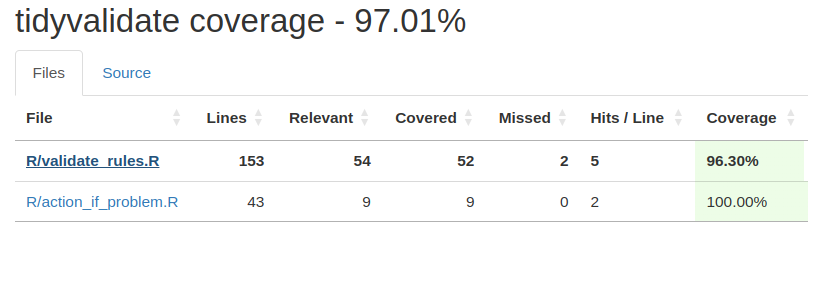
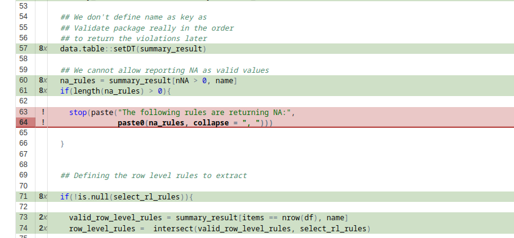

# Testing

**Learning outcomes:**

  - Purpose of automated testing
  - Different levels of test
  - Balance: speed, fragility, coverage
  - Reiterate: reactive code needs a reactive context

## Purpose of Automated Testing {-}

> Automated testing is a test method **without much user involvement during the process**.

They increase **robustness** and **reliability** of the application when:

- The application grows
- The development team changes

They ensure that:

- Changes don't break existing code
- Bugs don't arise again
- New code is working expected

## Four levels of testing for shiny apps {-}

> You should always strive to work at the **lowest possible level** so your tests are as **fast** and **robust** as possible.

- **Non-reactive** functions
- **Server function** tests by validating the flow of reactivity.
- **JavaScript** by running the app in a background web browser.
- **App visuals** by saving screenshots of selected elements *(fragile)*.

## Testing Basic structure {-}

1. Turn your app into a package

2. Create a test file for each function
  - If you have `R/module.R`
  - `usethis::use_test()` will create `tests/testthat/test-module.R`
  
3. Create tests to check a individual properties of a function by defining one or more `expect_` functions in `test_that()`.

```r
test_that("as.vector() strips names", {
  # ARRANGE (GIVEN)
  x <- c(a = 1, b = 2)
  
  # ACT (WHEN)
  x_unnamed <- as.vector(x)
  
  # ASSERT (THEN)
  expect_equal(x_unnamed, c(1, 2))
})
```

## load_file example {-}

1. Create the `R/load.R`.

```r
load_file <- function(name, path) {
  ext <- tools::file_ext(name)
  switch(ext,
    csv = vroom::vroom(path, delim = ",", col_types = list()),
    tsv = vroom::vroom(path, delim = "\t", col_types = list()),
    shiny::validate("Invalid file; Please upload a .csv or .tsv file")
  )
}
```

## load_file example {-}

2. Run `usethis::use_test("load")` and complete the new `test-load.R`.

```r
test_that("load_file() handles all input types", {
  # Create sample data
  df <- tibble::tibble(x = 1, y = 2)
  path_csv <- tempfile()
  path_tsv <- tempfile()
  write.csv(df, path_csv, row.names = FALSE)
  write.table(df, path_tsv, sep = "\t", row.names = FALSE)
  
  # 1. Can it load a csv file ?
  expect_equal(load_file("test.csv", path_csv), df)
  # 2. Can it load a tsv file ?
  expect_equal(load_file("test.tsv", path_tsv), df)
  # 3. Does it give an error message for other types?
  expect_error(load_file("blah", path_csv), "Invalid file")
})
```


## load_file example {-}

You can also use the `describe()` and `it()` functions to create the `test-load.R` with better error descriptions.

```r
describe("load_file()",{

  # Create sample data
  df <- tibble::tibble(x = 1, y = 2)

  it("can load a csv file",{
    path_csv <- tempfile()
    write.csv(df, path_csv, row.names = FALSE)
    expect_equal(load_file("test.csv", path_csv), df)
  })

  it("can load a tsv file",{
    path_tsv <- tempfile()
    write.table(df, path_tsv, sep = "\t", row.names = FALSE)
    expect_equal(load_file("test.tsv", path_tsv), df)
  })

  it("gives an error message for other types",{
    expect_error(load_file("blah", path_csv), "Invalid file")
  })

})
```

```
> devtools::test()
ℹ Testing quicktest
✔ | F W  S  OK | Context
✖ | 1        2 | load                                                                              
───────────────────────────────────────────────────────────────────────────────────────────────────
Error (test-load.R:21:5): load_file(): gives an error message for other types
```

## Ways to run tests {-}

1. Running each line interactively at the console. 
2. Running the whole test block, expecting to see a `Test passed 😀`.
3. Running all of the tests for the current file using `devtools::test_file()`.
4. Running all of the tests for the whole package using `devtools::test()`.

## Confirming test coverage {-}

1. Install the your current package using `devtools::install_local()`.
2. Run `devtools::test_coverage()` to show you've covered all your functions.



Shortcuts to add to Rstudio:

- [Ctrl + T] : `devtools::test_file()`
- [Ctrl + Shift + R] : `devtools::test_coverage()`
- [Ctrl + R] : `devtools::test_coverage_file()`

## Confirming test coverage {-}

1. Install the your current package using `devtools::install_local()`.
2. Run `devtools::test_coverage()` to show you've covered all your functions.




## expect_equal {-}

Here a simple example.

```r
complicated_object <- list(
  x = list(mtcars, iris),
  y = 10
)
expect_equal(complicated_object$y, 10)
```

The most popular cases of expect equal.

|Dedicated function|Equivalent expression|
|:----------------|:-------------------|
|`expect_true(x)`| `expect_equal(x, TRUE)` |
|`expect_false(x)`|`expect_equal(x, FALSE)`|
|`expect_null(x)`|`expect_equal(x, NULL)`|
|`expect_length(x, 10)`|`expect_equal(length(x), 10)`|
|`expect_named(x, c("a", "b", "c"))` |`expect_equal(names(x), c("a", "b", "c"))`|

<br>

> `expect_named()` also has the `ignore.order` and `ignore.case` arguments.


## Relaxed expect_equal {-}
  
- `expect_setequal(x, y)` tests:
  - Every value in `x` occurs in `y`
  - Every value in `y` occurs in `x`
  
<br>

- `expect_mapequal(x, y)` tests:
  - `x` and `y` have the same names.
  - `x[names(y)] == y`
  
## expect_error {-}

- You just need to create an error.

```r
expect_error(stop("Bye"))
```

- You can confirm if the error matches

```r
f <- function() {
  stop("Calculation failed [location 1]")
}

expect_error(f(),  "Calculation failed")
```

- We also have the functions:
  - `expect_warning()`
  - `expect_message()`
  
  
## expect_snapshot for UI functions {-}

> **Expected result is stored in a separate snapshot file**

- If we have

```r
sliderInput01 <- function(id) {
  sliderInput(id, label = id, min = 0, max = 1, value = 0.5, step = 0.1)
}

cat(as.character(sliderInput01("x")))
#> <div class="form-group shiny-input-container">
#>   <label class="control-label" id="x-label" for="x">x</label>
#>   <input class="js-range-slider" id="x" data-skin="shiny" data-min="0" data-max="1" data-from="0.5" data-step="0.1" data-grid="true" data-grid-num="10" data-grid-snap="false" data-prettify-separator="," data-prettify-enabled="true" data-keyboard="true" data-data-type="number"/>
#> </div>
```

## expect_snapshot for UI functions {-}

> **Expected result is stored in a separate snapshot file**

- If we can also test

```r
test_that("sliderInput01() creates expected HTML", {
  expect_equal(as.character(sliderInput01("x")), "<div class=\"form-group shiny-input-container\">\n  <label class=\"control-label\" id=\"x-label\" for=\"x\">x</label>\n  <input class=\"js-range-slider\" id=\"x\" data-skin=\"shiny\" data-min=\"0\" data-max=\"1\" data-from=\"0.5\" data-step=\"0.1\" data-grid=\"true\" data-grid-num=\"10\" data-grid-snap=\"false\" data-prettify-separator=\",\" data-prettify-enabled=\"true\" data-keyboard=\"true\" data-data-type=\"number\"/>\n</div>")
})
#> Test passed 😀
```

**But it makes too hard to see if the output changes**


## expect_snapshot for UI functions {-}

- Use `expect_snapshot()` to capture the output displayed on the console.

```r
test_that("sliderInput01() creates expected HTML", {
  expect_snapshot(sliderInput01("x"))
})
```

## expect_snapshot for UI functions {-}

- If your test is in `tests/testthat/test-slider.R`, it will save the output in `tests/testhat/_snaps/slider.md`

```md
# sliderInput01() creates expected HTML

    Code
      sliderInput01("x")
    Output
      <div class="form-group shiny-input-container">
        <label class="control-label" id="x-label" for="x">x</label>
        <input class="js-range-slider" id="x" data-skin="shiny" data-min="0" data-max="1" data-from="0.5" data-step="0.1" data-grid="true" data-grid-num="10" data-grid-snap="false" data-prettify-separator="," data-prettify-enabled="true" data-keyboard="true" data-data-type="number"/>
      </div>
```

- If it’s a deliberate change, **update the snapshot by running** `testthat::snapshot_accept()`.

## Testing reactivity {-}

The `testServer()` function (since Shiny 1.5.0) makes it possible to test code in server functions and modules, without needing to run the **full Shiny application** with the following characteristics:

- The UI can not be used.
- You'll need to add a `browser()` inside of `testServer()` to debug any problem.

<br>

> **Note**: For this section, I took some examples the articule [Server function testing](https://shiny.posit.co/r/articles/improve/server-function-testing/) from the original shiny documentation to have a **complete view** of how to use this functionality.


## Testing reactivity: Initial value {-}

1. Without UI all inputs **always** start as `NULL`.

```r
server <- function(input, output, session) {
 
  # Creates an reactive based on an input
  myreactive <- reactive({
    input$x * 2
  })
  
  # Updates an output
  output$txt <- renderText({
    paste0("I am ", myreactive())
  })
}

testServer(server, {
  print(input$x)
})
#> NULL
```

## Testing reactivity: setInputs method {-}

2. We need to add values to inputs by using the `session$setInputs()` method. 

```r
testServer(server, {
  session$setInputs(x = 10)
  print(input$x)
})
#> 10
```

## Testing reactivity: Modules {-}

3. We can test modules with arguments by passing a list to the `args` argument.

```r
myModule2 <- function(id, multiplier) {
  moduleServer(id, function(input, output, session) {
    myreactive <- reactive({
      input$x * multiplier
    })
    output$txt <- renderText({
      paste0("I am ", myreactive())
    })
  })
}

testServer(myModule2, args = list(multiplier = 3), {
  session$setInputs(x = 1)
  expect_equal(myreactive(), 3)
})
```

## Testing reactivity: returned method {-}

4. If the module returns an reactive object, the object also can be tested by using the `session$returned()` method.

```r
datasetServer <- function(id) {
  moduleServer(id, function(input, output, session) {
    reactive(get(input$dataset, "package:datasets"))
  })
}

test_that("can find dataset", {
  testServer(datasetServer, {
    dataset <- session$getReturned()
    
    session$setInputs(dataset = "mtcars")
    expect_equal(dataset(), mtcars)
    
    session$setInputs(dataset = "iris")
    expect_equal(dataset(), iris)
  })
})
#> Test passed 😸
```

## Testing reactivity: Simulated time  {-}

5. testServer uses **simulated time** that you control, rather than the actual computer time.

```r
server <- function(input, output, session){
  rv <- reactiveValues(x = 0)

  observe({
    # Cause the observer to invalidate every 0.1 second
    invalidateLater(100)
    isolate(rv$x <- rv$x + 1)
  })
}


testServer(server, {
  expect_equal(rv$x, 0)
  Sys.sleep(0.1)
  expect_equal(rv$x, 1)
})
#> Error: rv$x (`actual`) not equal to 1 (`expected`).
#>
#>   `actual`: 0
#> `expected`: 1
```

## Testing reactivity: elapse method  {-}

6. The **simulated time** can be controled by using the `session$elapse()` method.

```r
testServer(server, {
  expect_equal(rv$x, 0)
  session$elapse(100)   # Simulate the passing of 100ms
  expect_equal(rv$x, 1) # The observer was invalidated and the value updated!

  # You can even simulate multiple events in a single elapse
  session$elapse(300)
  expect_equal(rv$x, 4)
})
```

> Using this approach, this test can complete in only a **fraction of the 100ms** that it simulates.

- `reactivePoll()`
- `invalidateLater()`
- `reactiveTimer()`


## Testing reactivity: Render outputs {-}

7. It can confirm that a complex result like a plot or htmlwidgets were generated without an error. 

```r
server <- function(input, output, session){
  # Move any complex logic into a separate reactive
  # which can be tested comprehensively
  plotData <- reactive({
    data.frame(length = iris$Petal.Length, width = iris$Petal.Width)
  })

  # And leave the `render` function to be as simple as possible 
  # to lessen the need for integration tests.
  output$plot <- renderPlot({
    plot(plotData())
  })
}

testServer(server, {
  # Confirm that the data reactive is behaving as expected
  expect_equal(nrow(plotData()), 150)
  expect_equal(ncol(plotData()), 2)
  expect_equal(colnames(plotData()), c("length", "width"))

  # Just confirming that the plot can be accessed without an error
  output$plot 
})
```

## Testing reactivity: flushReact method {-}

8. If your module functions recives reactives as additinal arguments, you will need to use the `session$flushReact()` method to update the related outputs.

```r
summaryServer <- function(id, var) {
  stopifnot(is.reactive(var))
  
  moduleServer(id, function(input, output, session) {
    range_val <- reactive(range(var(), na.rm = TRUE))
    output$min <- renderText(range_val()[[1]])
    output$max <- renderText(range_val()[[2]])
    output$mean <- renderText(mean(var()))
  })
}

test_that("output updates when reactive input changes", {
  x <- reactiveVal()
  testServer(summaryServer, args = list(var = x), {
    x(1:10)
    session$flushReact()
    expect_equal(range_val(), c(1, 10))
    expect_equal(output$mean, "5.5")
    
    x(10:20)
    session$flushReact()
    expect_equal(range_val(), c(10, 20))
    expect_equal(output$min, "10")
  }) 
})
#> Test passed 🌈
```

## testServer limitations {-}

`testServer()`won't run any needed JavaScript, so the results of the following functions won't work:

- All `update*()` functions
- `showNotification()` / `removeNotification()`
- `showModal()` / `hideModal()`
- `insertUI()` / `removeUI()` / `appendTab()` / `insertTab()`/ `removeTab()`

## Testing JavaScript {-}

> **Note**: As shinytest has been **deprecated**, we are going to use the [Testing in depth](https://rstudio.github.io/shinytest2/articles/in-depth.html) vignette from **shinytest2**.

Limitations:

- This technique is slower than the other approaches.
- Only test the outside of the app can be tested.
- Visual tests are best run by one person on their **local computer** as it’s hard to get different computers to generate **pixel-reproducible screenshots**.


## Example with observeEvent {-}

```r
ui <- fluidPage(
  textInput("name", "What's your name"),
  textOutput("greeting"),
  actionButton("reset", "Reset")
)
server <- function(input, output, session) {
  output$greeting <- renderText({
    req(input$name)
    paste0("Hi ", input$name)
  })
  observeEvent(input$reset, updateTextInput(session, "name", value = ""))
}
```

## Discussions

  - Don't test the framework!
  - Don't test too early! Or do!
  - Testing religions / approaches
    - TDD: Test-driven development
    - BDD: Behaviour-driven development
    - TCR: Test && Commit || Revert


## Other interesting things {-}

- [Shinytest2 Vs Cypress: End-To-End (E2E) Testing In Shiny](https://www.appsilon.com/post/shinytest2-vs-cypress-e2e-testing)

- one of the {tinytest} vignettes has
  ["a few tips on packages and unit testing"](
    https://cran.r-project.org/web/packages/tinytest/vignettes/using_tinytest.pdf
  )
- two nice visualisations of
  [the TDD cycle](https://www.obeythetestinggoat.com/book/chapter_philosophy_and_refactoring.html#simple-TDD-diagram),
  and of
  [TDD-until-the-feature's ready](https://www.obeythetestinggoat.com/book/chapter_philosophy_and_refactoring.html#Double-Loop-TDD-diagram)
  are in "Test-Driven Development with Python" by Harry Percival.
- ["R Packages"](https://r-pkgs.org/tests.html) has a chapter about "testthat"
- The RStudio "shiny" website has
  [three  articles / webinars](https://shiny.rstudio.com/articles/testing-overview.html)
  on testing in shiny
- chapter-section on testing in
  ["Engineering Production-Grade Shiny Apps"](https://engineering-shiny.org/build-yourself-safety-net.html#testing-your-app)


## Meeting Videos

### Cohort 1

`r knitr::include_url("https://www.youtube.com/embed/8ZTGDbH1MaE")`

### Cohort 2

`r knitr::include_url("https://www.youtube.com/embed/nwAg54rA3xs")`

<details>
  <summary> Meeting chat log </summary>
  
```
00:08:40	collinberke:	https://github.com/collinberke/ga4WebDash
00:43:42	Kevin Gilds:	https://rich-iannone.github.io/pointblank/
00:50:43	Kevin Gilds:	https://github.com/yonicd/covrpage
```
</details>

`r knitr::include_url("https://www.youtube.com/embed/eguok48Piyg")`


### Cohort 3

`r knitr::include_url("https://www.youtube.com/embed/MNf6w_FpxVw")`

<details>
  <summary>Meeting chat log</summary>
```
00:28:35	Oluwafemi Oyedele:	https://github.com/collinberke/ga4WebDash
00:58:38	Oluwafemi Oyedele:	https://adv-r.hadley.nz/names-values.html#gc
```
</details>


### Cohort 4

`r knitr::include_url("https://www.youtube.com/embed/7Uz0Mh2gMfk")`

<details>
  <summary>Meeting chat log</summary>
```
00:10:54	Trevin Flickinger:	start
00:12:01	Trevin Flickinger:	https://rstudio-conf-2022.github.io/build-tidy-tools/
00:12:19	Trevin Flickinger:	https://rstudio-conf-2022.github.io/build-tidy-tools/materials/day-1-session-3-testing.html#/title-slide
00:21:47	Trevin Flickinger:	https://r-pkgs.org/index.html
00:27:17	Matthew Efoli:	thank you
00:42:42	Trevin Flickinger:	https://github.com/rstudio-conf-2022/ussie
01:04:39	Trevin Flickinger:	stop
```
</details>


### Cohort 5

`r knitr::include_url("https://www.youtube.com/embed/URL")`

<details>
  <summary>Meeting chat log</summary>
```
LOG
```
</details>
