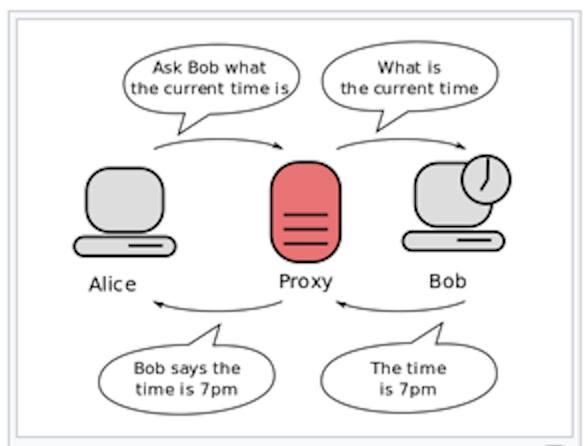

# Security

**Learning objectives**:

In this chapter, we learn **how to prevent some undesired outputs** caused by malicious attackers and/or misleading of inputs allowed by some function combinations.


------------------------

Introduction

1 - The security within your app: Data

2 - Compute resources

3 - Publishing on shinyapps.io

Conclusions

----------------------


## Introduction

In general:

> Who deploys the app is responsible for security between apps, and within your app


But... it’s possible for a knowledgeable attacker to send values that are not expected... 

The advice about *How to secure your device by attackers* is not exhaustive. We need to search for alternative solutions to the impossibility of stopping an attacker from invading your app and its content. 

It is important not to underestimate combinations or substitutions of functions that would be preventable errors in chain creation.


--------------------------


## The security within your app

Two main security actions:

```{r echo=FALSE}
DiagrammeR::mermaid("
graph LR
A(validation)-.and.-B(isolation)
style A fill:#f9f
style B fill:#f9f",
height = '100%', width = '100%')
```


- Shiny `inputs` use client-side **validation** such as data that is user-specific and need the user to authenticate before use

- Shiny `server()` code **isolation**; one user cannot see data from another user in a different session, the only exception is if caching is in use, more about this is specified in the last chapter of the book

----------------------

**Data**

Sensitive data and passwords are the most targeted objectives of the attackers, for this reason is recommended to:

- do not storage password in the source code of your app, but eventually, in a variable in the environment

- use a **.yml** file to storage login credentials

- use `.gitignore` to include the appropriate files containing your authentication credentials


--------------------------

**Authentication** and **client-side validation**


There is more than one alternative to authenticate, first thing is that you need to **add some kind of layer between the user interface and the Shiny server**, i.e. a **proxi**
```{r echo=FALSE, fig.align='center', fig.cap='proxy', out.width='50%'}

```


It will redirect the user to an authentication page, as in a login page, and once authenticated it will check whether the user is authorized, and then let them get access to the Shiny application. 


---------------------------

The following section lists five packages for configuration, authentication, and storage of login credentials. There are several options to choose from based on your need and design of the app.


**Packages:**

1 - The first package suggested by the [book](https://mastering-shiny.org/scaling-security.html) is **[{config}](https://cran.r-project.org/web/packages/config/vignettes/introduction.html)** package, it is used to manage environment specific configuration values.

```{r echo=FALSE, fig.align='center', fig.cap='config package', out.width='15%'}

```
How to install **config** and all the other packages (substituting the package's name where appropriate):

    install.packages("config")
    library(config)

How to storage the password in a file with [config in practice](https://db.rstudio.com/best-practices/managing-credentials/) ? 

The package makes easier to deploy content, and in this contest is used to keep the credentials outside of the R script by saving them in the **config.yml** file while keeping it in the current working directory.

[YAML(tm)](https://yaml.org/about.html) are type of files made for making easier international collaboration with a language which is both human readable and computationally powerful.

An example of a .yml file is a **config.yml** file:

    default:
    uid: "my-name"
    pwd: "my-password"


And to recall the information back from its directory:

    config <- config::get(file = "conf/config.yml")
    config$uid
    config$pwd
    
    
-------------------------


2 - Another interesting package, mentioned in the search-engine of "securing a Shiny app" is **[{auth0}](https://curso-r.github.io/auth0/index.html)** package. 

```{r echo=FALSE, fig.align='center', fig.cap='auth0 package', out.width='15%'} 

```

It is an identity provider, it offers a server where to storage shiny apps as well as procedures for setting credentials at access. You need an account where to load your app and set up the credentials.

`_auth0.yml` files can be created with the command `use_auth0()` which can be automatically positioned in the app.R directory and it is already filled with basic information:

      auth0::use_auth0()
      
Here is the content of the `_auth0.yml` file:

      name: myApp
      remote_url: ''
      auth0_config:
      api_url: !expr paste0('https://', Sys.getenv('AUTH0_USER'), '.auth0.com')
      credentials:
      key: !expr Sys.getenv("AUTH0_KEY")
      secret: !expr Sys.getenv("AUTH0_SECRET")
      
Then set up the keys using

      usethis::edit_r_environ("project")      
      
which adds a `.Renviron` file in your project directory for you to modify the content with 

      AUTH0_USER   = ...
      AUTH0_KEY    = ...
      AUTH0_SECRET = ...

It adds a layer between Shiny and the user. And then you can retrieve the credentials using `Sys.getenv()`

      auth0::Sys.getenv("AUTH0_USER")      

This method is not exclusive of `auth0`package but is a recommended approach to use for storing **Credentials inside Environment Variables** even with other packages.


---------------------------------


3 - A simple and secure authentication mechanism for single ‘Shiny’ applications is through **[{shinymanager}](https://datastorm-open.github.io/shinymanager/)** package.


```{r echo=FALSE, fig.align='center', fig.cap='shinymanager package', out.width='25%'} 

```


Here is a live demonstration of the potentiality of this package:

- [Shiny-server](http://shinyapps.dreamrs.fr/shinymanager-demo/)
- [shinyapps.io](https://dreamrs.shinyapps.io/shinymanager-demo/)

it follows with these authentication credentials:

    user: shiny / password: shiny
    user: shinymanager / password: shinymanager (Admin)


In particular it provides a function to `secure_app()` in which to wrap the `ui`:

    Wrap your UI with secure_app
    ui <- secure_app(ui, choose_language = TRUE)

As well as in the `server()` with the following commands:  
    
    secure_server()
    check_credentials()

-----------------------------


4 - The **[{shinyauthr}](https://paulc91.github.io/shinyauthr/)** package is very useful for providing key function to use. 
```{r echo=FALSE, fig.align='center', fig.cap='shinyauthr package', out.width='25%'} 
knitr::include_graphics('images/22-security/shinyauthr.png')
```

These are the main functions which invisibly call JavaScript with the command `shinyjs::useShinyjs()` internally:

    loginUI()
    loginServer()
    logoutUI()
    logoutServer()

It also provides a method for **cookie-based automatic login**, which means that the system can store the credentials for some time as established by the creator of the app. 


--------------------------------


5 - **[{sodium}](https://github.com/jeroen/sodium)** package is software library for encryption, decryption, signatures, password hashing and more.
```{r echo=FALSE, fig.align='center', fig.cap='sodium package', out.width='25%'} 

```

Generally used in this contest to encrypt passwords with simple commands such as:

    user_name = "user_authr_1",
    password  = sodium::password_store("pass_authr_1")
    
which releases the passowrd in this format:

```{r}
password = "pass_authr_1"
sodium::password_store(password)
```


```{r}
hash <- sodium::password_store(password)
sodium::password_verify(hash, password)
```


-------------------------------------


Another suggestion by the [book](https://mastering-shiny.org/scaling-security.html) is to use:

```{r echo=FALSE, fig.align='center', fig.cap='Kerberos', out.width='25%'}

```

[Kerberos](https://solutions.rstudio.com/sys-admin/auth/kerberos/) (/ˈkɜːrbərɒs/) is a computer-network authentication protocol developed by Massachusetts Institute of Technology (MIT) and classified as "Auxiliary Military Equipment" by the authorites for its capacities of Data Encryption Standard (DES).

The development of the product followed with version updates and the implementation by other institutions included the Royal Institute of Technology in Sweden and the Stanford University made the system available outside the US with some limitations. 
Kerberos is available with RStudio Pro Products.


----------------------------


In general what happens in an app when setting up login credentials is described below.

In the `ui` you can use these commands for wrapping your code and build a module, while in the `server()` you should mind not to storage any form of credentials, but as said, storage them in a separate file (.xlm , .yml , .rds, .Renviron, ...). 

The `server()` should include the `eventReactive()` function to check whether the user’s login and password are valid credentials,  raising a silent validation error.

    server<- function(input,output,session){
  
    eventReactive() 
  
    }


---------------------------------


**Examples:**

1 - In this example is shown for simplicity an application of the **{shinyauthr}**: the credentials are located inside the `server()`, they should be in a `config.yml` file and then retrieved for use.

You may find yourself being prompted with something like this:

```{r echo=FALSE, fig.align='center', fig.cap='Credentials', out.width='50%'}

```


```{r}
library(shiny)

# dataframe that holds usernames, passwords and other user data
user_base <- dplyr::tibble(
  user = c("user1", "user2"),
  password = c("pass1", "pass2"),
  permissions = c("admin", "standard"),
  name = c("User One", "User Two")
)


ui <- fluidPage(
  # add logout button UI
  div(class =  "pull-right", # The HTML tag functions in Shiny, like div() and p() return objects that can be rendered as HTML
      shinyauthr::logoutUI(
        id = "logout")),
  # add login panel UI function
      shinyauthr::loginUI(
        id = "login"),
  # setup table output to show user info after login
  tableOutput("user_table")
)

server <- function(input, output, session) {
  # call login module supplying data frame, 
  # user and password cols and reactive trigger
  credentials <- shinyauthr::loginServer(
    id = "login",
    data = user_base,
    user_col = user,
    pwd_col = password,
    log_out = reactive(logout_init())
  )
  
  # call the logout module with reactive trigger to hide/show
  logout_init <- shinyauthr::logoutServer(
    id = "logout",
    active = reactive(credentials()$user_auth)
  )
  
  output$user_table <- renderTable({
    # use req to only render results when credentials()$user_auth is TRUE
    req(credentials()$user_auth) # only run after a successful login
    credentials()$info
  })
}

#shinyApp(ui = ui, server = server)
```


When accessing an API or database in R, Shiny inputs use **client-side validation**  and often requires to [provide credentials](https://www.r-bloggers.com/2019/03/how-to-avoid-publishing-credentials-in-your-code/) such as a login name and password. 


2 - Another example of Shiny inputs using **client-side validation** (input performed by JavaScript in the browser) where is possible for an attacker to send unexpected values is:

```{r}
secrets <- list(
  a = "my name",
  b = "my birthday",
  c = "my social security number", 
  d = "my credit card"
)

allowed <- c("a", "b")
ui <- fluidPage(
  selectInput("x", "x", choices = allowed),
  textOutput("secret")
)

```

An attacker can open up a JavaScript console in their browser and run `Shiny.setInputValue("x", "c")` to see client data that are not allowed to see.

To add a layer of security, in the `server()` is added the `req()` function, which ensure that values are available, and if any of the given values is not truthy, the operation is stopped by raising a "silent" exception.

    ?req()


```{r}
server <- function(input, output, session) {
  output$secret <- renderText({
    req(input$x %in% allowed) # this function 
    secrets[[input$x]]
  })
}

# shinyApp(ui = ui, server = server)
```

-------------------------


Finally, in case you want to skip the authentication step when testing the app:

- Use `testthat::skip()` to automatically skip tests that require authentication.


---------------------


## Compute resources


What about errors, holes, dangerous function combinations, selective characters such as special characters that are not recognizable by the system language? What can be done to prevent unexpected values from being used?


Malicious attackers can:

- run any R code they want
- delete important files
- modify data
- send confidential data back to the user of the app


-------------------------------------


You should never:

- `source()` an uploaded .R file
- `rmarkdown::render()` an uploaded .Rmd

Mind:

- the combination of `parse()` and `eval()` as big warning sign for any Shiny app

Danger:

- it is possible to ask R to execute arbitrary code inside a model formula


----------------------------------------


Below are some examples of dangerous app chunks:

1 - This first example shows how the combination of `parse()` and `eval()` allows the user to insert only numeric values.


    server <- function(input, output, session) {
    
      output$results <- renderText({
    
        eval(parse(text = input$code))
     
      })
    }


2 - Other kinds of possibilities for error chain generators are given by the **model formula**, the formula can executes an extra command `print()`

    lm(y ~ {print("Hi!"); x}, data = df)

    #> [1] "Hi!"
    
    
    
3 - Third warning comes from the **{glue}** package, the book in this case suggests to pay attention to use: 

    glue::glue("{title}-{print('Hi'); number}")
    
and suggests to substitute with `glue_safe()` which instead releases an error/warning:

    glue::glue_safe("{title}-{print('Hi'); number}")
    
    #> Error in .transformer(expr, env): object 'print('Hi'); number' not found
    
    
4 - In case of **variable transformation**, this is what can happen:    
    
```{r, echo=FALSE,out.width='25%', fig.align='center', fig.cap='https://xkcd.com/327/'}
knitr::include_graphics('images/22-security/xkcd.png')
```

The code to construct a SQL query with `paste()` could lead to *flexibilities* in code costruction that would allow the addition of extra characters not warned or advised by any friendly error messages

```{r}
find_student <- function(name) {
  paste0("SELECT * FROM Students WHERE name = ('", name, "');")
}


find_student("Hadley")
find_student("Robert'); DROP TABLE Students; --")

```

**solution**: use `glue::glue_sql()`
```{r}
con <- DBI::dbConnect(RSQLite::SQLite(), ":memory:")


find_student <- function(name) {
  
  glue::glue_sql("SELECT * FROM Students WHERE name = ({name});", .con = con)
}


find_student("Robert'); DROP TABLE Students; --")

```


--------------------


## Publishing on shinyapps.io


Security for your applications running on shinyapps.io:
all access to the apps is over SSL; you can configure your app to require authentication before anyone accessing it; in addition, every account has its sub-directory structure as a double layer of security.


--------------------------


## Conclusions:

Securing an **app** might require some extra work around all the information available as well as all the extra available packages and functions that can be used for authenticating and avoid the wrongful combination of functions/commands.

This might be the case for apps containing sensitive information or for those one letting the users access restricted data.


### Resources:

- [SecuringShiny](https://globalparametrics.github.io/SecuringShiny/)
- [shinypassword](https://github.com/treysp/shiny_password)
- [Run as the authenticated user](https://support.rstudio.com/hc/en-us/articles/236020708-Strategies-for-connecting-Shiny-applications-to-databases)
- [Securing Deployed Content](https://db.rstudio.com/best-practices/deployment/)
- [Kerberos](https://en.wikipedia.org/wiki/Kerberos_(protocol))
- [Kerberos with RStudio Pro Products](https://solutions.rstudio.com/sys-admin/auth/kerberos/)
- [Kerberos Authentication](https://docs.rstudio.com/connect/admin/authentication/pam-based/kerberos/)
- [shinyapps.io security and compliance](https://docs.rstudio.com/shinyapps.io/security-and-compliance.html)
- [How does cryptography work?](https://cran.r-project.org/web/packages/sodium/vignettes/crypto101.html)


Extra Packages:

- [config on github](https://github.com/rstudio/config)
- [auth0](https://github.com/curso-r/auth0)
- [shinymanager](https://datastorm-open.github.io/shinymanager/)
- [keyring](https://r-lib.github.io/keyring/index.html) [tips on how to use it](https://www.infoworld.com/article/3320999/r-tip-keep-your-passwords-and-tokens-secure-with-the-keyring-package.html) storing sets of encrypted credentials in a local file
- [rstudioapi](https://github.com/rstudio/rstudioapi)
- [secrets](https://cran.r-project.org/web/packages/httr/vignettes/secrets.html) or cyphr packages for github secrets
- [testthat](https://testthat.r-lib.org/)
- [sodium](https://cran.r-project.org/web/packages/sodium/vignettes/intro.html) for cryptography
- [rtweet](https://github.com/ropensci/rtweet) [rtweet more reading](https://medium.com/@skyetetra/how-to-make-rtweet-r-shiny-apps-with-user-credentials-48acca246b58)
- [shinyauthr](https://github.com/PaulC91/shinyauthr)


------------------------------

