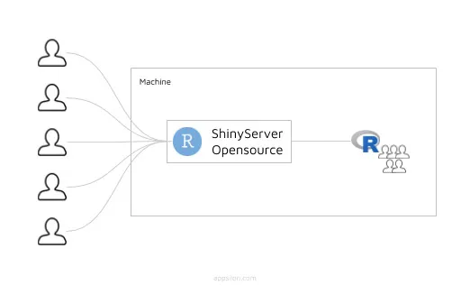
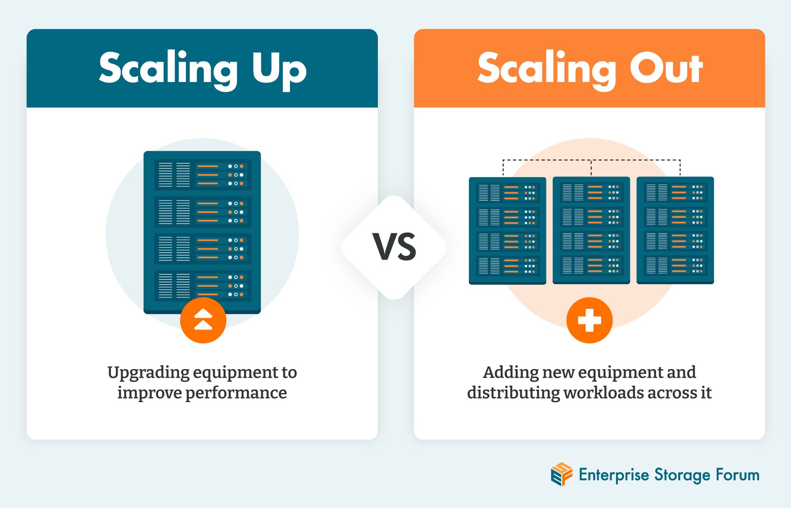
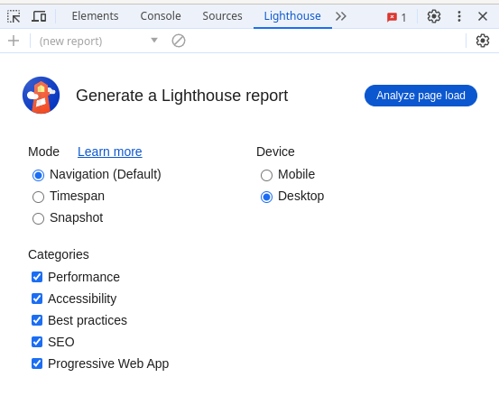
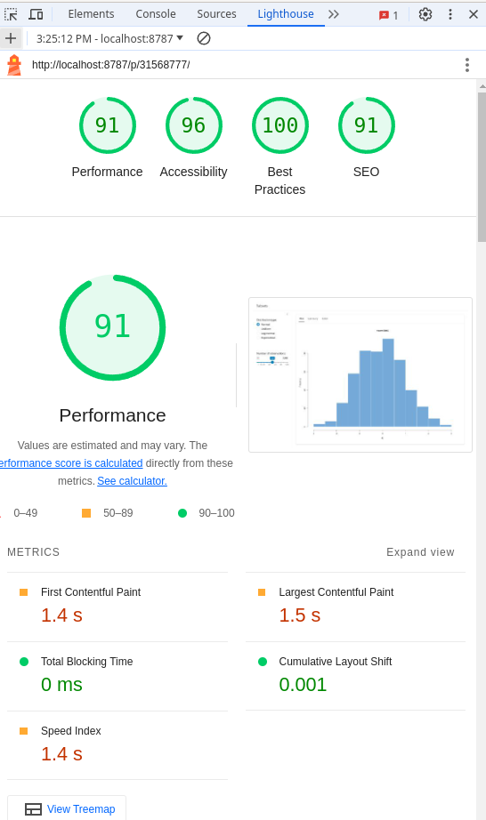
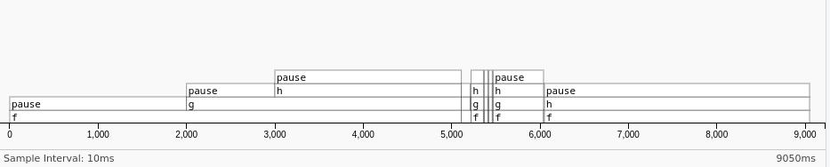
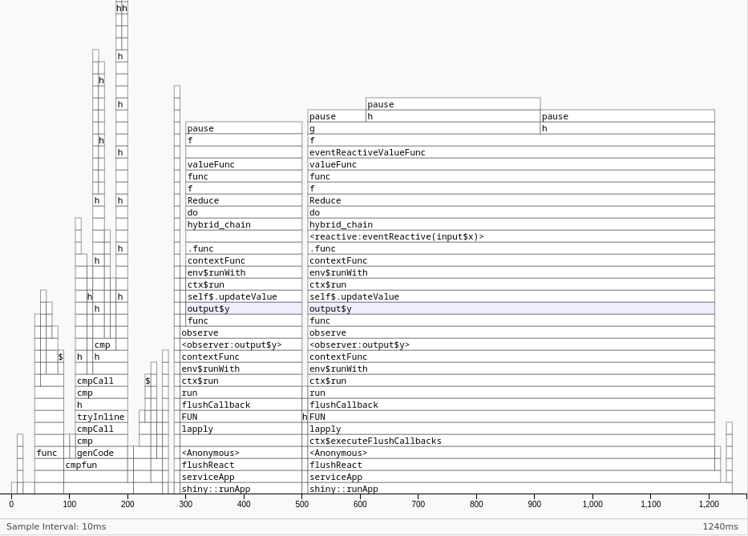

# Performance

> Transform your **poor-performing prototype app** into a fast one capable of handling **thousands to tens of thousands of users simultaneously**.

**Learning Objectives**

- **Benchmark** your app using the **shinyloadtest** package to simulate multiple users.
- **Audit** your app with the **Google Lighthouse** node.js package to evaluate front-end performance.
- **Profile** your app to identify performance bottlenecks:
  - Use the **profvis** package to pinpoint slow R code.
  - Use **shiny.tictoc** JavaScript to measure:
    - *Time spent on server-side calculations*
    - *Time needed to recalculate outputs*
- **Optimize** your code by:
  - Moving data preparation code outside the app
  - Making the code faster
  - Caching reactives and outputs 
  - Applying psychological principles to make your app feel faster


## Dining at restaurant Shiny {-}

A Shiny app is like a restaurant where:

- Server $\approx$ Kitchen
- User $\approx$ Customer
- Request $\approx$ Order
- R process $\approx$ Chef

> But our chef can only start a new order after finishing the prior one (**single-threaded**), unless we make the event independent to the main program flow by using **async programming** techniques.




## Making your chef more efficient {-}

- **Profiling**: Watching your chef when working to find the bottlenecks.
- **Optimizing**: Brainstorming ways to help them work faster, like:
  - Hiring a prep cook who can come in before the first customer and chop some vegetables (preparing the data).
  - Invest in a time-saving gadget (a faster R package).
  - Adding more chefs (processes) to the restaurant (server).


## Solving kitchen limitations {-}

If you keep hiring more chefs, eventually the kitchen (server) will get **too full**, so you have 2 alternatives:

- Adding more equipment (memory or cores) to **scale up**.
- Building more restaurants to **scale out**.

{width="80%" height="80%"}


## Benchmarking {-}

I will help you figure out how many **users** each **process** can handle.

The [shinyloadtest](https://rstudio.github.io/shinyloadtest/) package and has three basic steps:

1. Record a script simulating a typical user with `shinyloadtest::record_session()`.

2. Replay the script with multiple simultaneous users with the **shinycannon** command-line tool.

3. Analyse the results using **shinyloadtest::report()**.


## Benchmarking: Recording {-}

1. Start your app from the terminal and copy the URL that it gives you.

```bash
Rscript -e "shiny::runApp('examples/23-performance/Tabsets-App.R', port = 5555)"
```

2. Then paste the URL into a `record_session()` call:

```r
shinyloadtest::record_session("http://127.0.0.1:5555")
```

3. On the new window, interact with the app to simulate a “typical” user, including pauses to reflect the thinking time that a real user would need.

4. Close the app, and shinyloadtest will save `recording.log` to your working directory.

5. Move the `recording.log` file to the folder to store the benchmark results.

```bash
mv recording.log examples/23-performance
```

## Benchmarking: Replay {-}

**shinycannon** is written in Java because the Java programming language is particularly well suited to the problem of performing tens or hundreds of web requests in parallel.

```bash
shinycannon examples/23-performance/recording.log http://127.0.0.1:5555 \
  --workers 1 \
  --loaded-duration-minutes 5 \
  --output-dir examples/23-performance/test_sessions/test1
```

```bash
shinycannon examples/23-performance/recording.log http://127.0.0.1:5555 \
  --workers 5 \
  --loaded-duration-minutes 5 \
  --output-dir examples/23-performance/test_sessions/test5
```

```bash
shinycannon examples/23-performance/recording.log http://127.0.0.1:5555 \
  --workers 10 \
  --loaded-duration-minutes 5 \
  --output-dir examples/23-performance/test_sessions/test10
```

## Benchmarking: Analysis {-}


```{r eval=FALSE}
BenchmarkData <- shinyloadtest::load_runs(
  `1 user` = "examples/23-performance/test_sessions/test1",
  `5 users` = "examples/23-performance/test_sessions/test5",
  `10 users` = "examples/23-performance/test_sessions/test10"
)
```

```{r eval=FALSE}
# If you getting errors related to gtable
# you can install this branch of dev version
# remotes::install_github("rstudio/shinyloadtest@gtable-error")

shinyloadtest::shinyloadtest_report(BenchmarkData, "examples/23-performance/report.html")
```

## Benchmarking: Analysis report {-}

*This slide takes __a few seconds__ to load 9.7 MB*

[Next Slide](#Lighthouse)

<iframe src="./examples/23-performance/report.html" width="950" height="600">


## Audit Google Lighthouse: Start {- #Lighthouse}



## Audit Google Lighthouse: Results {-}




## Profiling: Example function {-}

If your app is spending a lot of time calculating, you next need to figure out **which calculation** is slow.

```{r eval=FALSE}
library(profvis)

f <- function() {
  pause(2)
  g()
  h()
  10
}
g <- function() {
  pause(1)
  h()
}
h <- function() {
  pause(3)
}
```

## Profiling: Example diagram {-}

Running `f()` mentally.

|**Initial state**|**Conceptual description**|
|:----------------|:-------------------------|
|`f()` <br> --`g()` <br> ----`h()` <br> --`h()`|f <br> f > g <br> f > g > h <br> f > h|

{width="80%" height="80%"}


## Profiling: R code {-}

```{r eval=FALSE}
profvis::profvis(f())
```



## Profiling: Shiny App {-}

```{r eval=FALSE}
ui <- fluidPage(
  actionButton("x", "Push me"),
  textOutput("y")
)
server <- function(input, output, session) {
  output$y <- eventReactive(input$x, f())
}

# Note the explicit call to runApp() here: this is important
# as otherwise the app won't actually run.
profvis::profvis(runApp(shinyApp(ui, server)))
```



## Profiling: Limitations {-}

As we need to stop the process and inspect what R functions are currently runnning to show in the report:

- Certain C functions that don’t regularly check for user interrupts.
- `Sys.sleep()` asks the operating system to “park” the process for some amount of time, so R is not actually running. 
- Downloading data from the internet won’t be tracked by R.

## Profiling: shiny.tictoc {-}

To start using [`shiny.tictoc`](https://github.com/Appsilon/shiny.tictoc) in your app, just add the following line somewhere in your UI definition

```r
tags$script(
    src = "https://cdn.jsdelivr.net/gh/Appsilon/shiny.tictoc@v0.2.0/shiny-tic-toc.min.js"
)
```

To access the benchmarks [open the browser's developer tools](https://developer.mozilla.org/en-US/docs/Learn/Common_questions/Tools_and_setup/What_are_browser_developer_tools) (Windows: <kbd>F12</kbd>, macOS <kbd>⌘</kbd> + <kbd>⌥</kbd> + <kbd>I</kbd>) and in the console run:

```js
// To export an html file that visualizes measurements on a timeline
await exportHtmlReport()

// To download all measurements as a CSV file
exportMeasurements()
```

## Profiling: shiny.tictoc results {-}

[Next Slide](#ImprovePerformance)

<iframe src="./examples/23-performance/2024_07_07-15_24_26-tictoc.html" width="950" height="600">

## Improve performance {- #ImprovePerformance}

- **Find the slowest thing** in the profile, and try to speed it up.
  - Isolate the problem in a function.
  - Make a minimal snippet of code that recreates the slowness
  - Write a few tests as the *easiest way to make code faster* is to make it **incorrect**.
  - Run this snippet multiple times as you try out possible improvements.
  
  
## Improve performance: Caching {-}

It is really useful if **many people** want to see the **same results**.

**Process**

1. Record the inputs to and outputs from every call to a function.
2. When the cache function is called with a set of inputs that it’s already seem:
  - Replay the recorded output without recomputing
  
  
## bindCache(): Basics {-}

- It will work with the `reactive()` or `render*` function.

- The additional arguments are are the **cache keys** (to determine if a computation has been seen before)

```r
r <- reactive(slow_function(input$x, input$y)) %>% 
  bindCache(input$x, input$y)

output$text <- renderText(slow_function2(input$z)) %>% 
  bindCache(input$z)
```


## bindCache(): web API {-}

1. Design a function to get what people have been working on lately.

```r
library(purrr)

latest_events <- function(username) {
  json <- gh::gh("/users/{username}/events/public", username = username)
  tibble::tibble(
    repo = json %>% map_chr(c("repo", "name")),
    type = json %>% map_chr("type"),
  )
}
```

## bindCache(): web API {-}


```r
system.time(hadley <- latest_events("hadley"))
#>    user  system elapsed 
#>   0.074   0.015   0.796
head(hadley)
#> # A tibble: 6 × 2
#>   repo            type             
#>   <chr>           <chr>            
#> 1 tidyverse/purrr IssueCommentEvent
#> 2 tidyverse/purrr IssueCommentEvent
#> 3 tidyverse/purrr IssuesEvent      
#> 4 tidyverse/purrr IssueCommentEvent
#> 5 tidyverse/purrr IssueCommentEvent
#> 6 tidyverse/purrr IssueCommentEvent
```


## bindCache(): web API {-}

2. Turn the function into a very simple app.

```r
ui <- fluidPage(
  textInput("username", "GitHub user name"),
  tableOutput("events")
)
server <- function(input, output, session) {
  events <- reactive({
    req(input$username)
    latest_events(input$username)
  })
  output$events <- renderTable(events())
}
```

## bindCache(): web API {-}

3. Cache effectively only lasts for a single day.

```r
server <- function(input, output, session) {
  events <- reactive({
    req(input$username)
    latest_events(input$username)
  }) %>%
  bindCache(input$username, Sys.Date())
  
  output$events <- renderTable(events())
}
```

> The cache has a **fixed total size** so it won't **accumulate data** from previous days, and is smart enough to **automatically remove the least recently** used data when it needs more space.


## bindCache(): Plots {-}

- Each plot is drawn in a **variety of sizes**, because the default plot occupies 100% of the available width, which varies as you **resize the browser**.

- `bindCache()` caches plots with **fixed sizes**.

```r
library(ggplot2)

ui <- fluidPage(
  selectInput("x", "X", choices = names(diamonds), selected = "carat"),
  selectInput("y", "Y", choices = names(diamonds), selected = "price"),
  plotOutput("diamonds")
)

server <- function(input, output, session) {
  output$diamonds <- renderPlot({
    ggplot(diamonds, aes(.data[[input$x]], .data[[input$y]])) + 
      geom_point()
  }) %>% bindCache(input$x, input$y)
}
```

## bindCache(): reactive inputs {-}

- The **cache key** should always include **all of the reactive inputs** in the expression.

- keep the cache keeps as simple as possible. Don’t use large datasets because it is **expensive** to figure out if a **large data frame has already been** seen.

```r
r <- reactive(input$x + input$y) %>% bindCache(input$x)
```

## bindCache(): Default cache scope {-}

- The plot cache is stored in memory.
- It is never bigger than 200 MB.
- It is shared across all users a single process.
- It is lost when the app restarts.

## bindCache(): Extending cache scope {-}

- If sharing data between users its a concern, we can separate cache for each user sessions.

```r
bindCache(…, cache = "session")
```

- If we want to share the **cache across multiple processes** and lasts across app restarts.

```r
shinyOptions(cache = cachem::cache_disk())
```

- We can **chain multiple caches** together or write your own custom storage backend with [cachem](https://cachem.r-lib.org/).


## Other Optimisations: Data munging {-}

As the server function is called every time a **new session starts**.

If you use some data that looks **always the same**, you should move that process outside the server function.

```r
my_data_prep <- function() {
  df <- read.csv("path/to/file.csv")
  df %>% 
    filter(!not_important) %>% 
    group_by(my_variable) %>% 
    some_slow_function()
}

df <- my_data_prep()

server <- function(input, output, session) {
  # Lots more code
}

```

## Other Optimisations: Data munging {-}

Use the most efficient way to load your data

* If you have a flat file, try `data.table::fread()` or `vroom::vroom()` instead of `read.csv()` or `read.table()`.

* If you have a data frame, try saving with `arrow::write_feather()` and reading with `arrow::read_feather()`. Feather is a binary file format that can be considerably faster to read and write.

* If you have objects that aren’t data frames, try using `qs::qread()`/`qs::qsave()` instead of `readRDS()`/`saveRDS()`.


## Other Optimisations: User expectations {-}

Design app to make it feel faster

- Split your app up into tabs, using `tabsetPanel()`.
- Require a button press to start a long-running operation and let the user know **what’s happening**.
- If the app requires significant work to happen on startup make sure to design your app so that the **UI can still appear**, to let the user know that they’ll need to wait.
- If you want to **keep the app responsive** while some expensive operation happens in the background, it’s time to learn about the new [ExtendedTask](https://rpubs.com/jcheng/beyond-async)  function.

## Resources {-}

- [Using Google Lighthouse for Web Pages](https://www.jumpingrivers.com/blog/shiny-app-start-up-google-lighthouse-part-1/)
- [Beyond Async](https://rpubs.com/jcheng/beyond-async)
- [https://rstudio.com/resources/rstudioconf-2019/shiny-in-production-principles-practices-and-tools/]()
- [https://rstudio.github.io/shinyloadtest/articles/analyzing-load-test-logs.html]()
- [https://queue.acm.org/detail.cfm?id=2927301]()
- [https://adv-r.hadley.nz/perf-improve.html]()
- [https://csgillespie.github.io/efficientR/]()
- [https://rstudio.com/resources/rstudioconf-2018/make-shiny-fast-by-doing-as-little-work-as-possible/]()
- [https://shiny.rstudio.com/articles/caching.html]()
- [https://shiny.rstudio.com/app-stories/weather-lookup-caching.html]()


## Meeting Videos {-}

### Cohort 1

`r knitr::include_url("https://www.youtube.com/embed/LLO6vDLqhWw")`

<details>
  <summary> Meeting chat log </summary>
  
```
00:07:09	Russ Hyde:	Hi
00:45:54	Robert Overman:	Are we having a session on shiny server?
01:01:58	docksbox@pm.me:	Thanks!
01:04:51	docksbox@pm.me:	Yes, sure
```
</details>

### Cohort 2

`r knitr::include_url("https://www.youtube.com/embed/UwrBxS39E3g")`


### Cohort 3

`r knitr::include_url("https://www.youtube.com/embed/GFbRR--E8Ow")`

<details>
  <summary>Meeting chat log</summary>
```
00:06:14	Brendan Lam:	What function records interactions with your Shiny app? How do you simulate users interacting with your app?
What is a flame graph and how do you interpret it?
What are the cache key and scope?
What are two ways of optimizing your app
00:09:25	Brendan Lam:	https://rstudio.github.io/promises/
00:14:39	Brendan Lam:	https://github.com/rstudio/shinycannon/issues/69#issuecomment-1322390215
00:22:46	Brendan Lam:	We start with f().
Then f() calls g(),
Then g() calls h().
Then f() calls h().
00:28:03	Brendan Lam:	https://memoise.r-lib.org/
00:38:16	Brendan Lam:	arrow::write_feather()
00:38:23	Brendan Lam:	arrow::read_feather()
00:38:30	Brendan Lam:	qs::qread()/qs::qsave() instead of readRDS()/saveRDS()
00:41:15	Brendan Lam:	https://rstudio.com/resources/rstudioconf-2019/shiny-in-production-principles-practices-and-tools/
https://rstudio.github.io/shinyloadtest/articles/analyzing-load-test-logs.html
https://queue.acm.org/detail.cfm?id=2927301
https://adv-r.hadley.nz/perf-improve.html
https://csgillespie.github.io/efficientR/
https://rstudio.com/resources/rstudioconf-2018/make-shiny-fast-by-doing-as-little-work-as-possible/
https://shiny.rstudio.com/articles/caching.html
https://shiny.rstudio.com/app-stories/weather-lookup-caching.html
00:45:15	Brendan Lam:	https://twitter.com/brendannathanl1
```
</details>


### Cohort 4

`r knitr::include_url("https://www.youtube.com/embed/bxSj2VdA8XI")`

<details>
  <summary>Meeting chat log</summary>
```
00:09:46	Trevin Flickinger:	start
00:15:04	Trevin Flickinger:	https://rstudio.github.io/shinyloadtest/articles/case-study-scaling.html
00:15:54	Trevin Flickinger:	https://posit.co/resources/videos/shiny-in-production-principles-practices-and-tools/
00:22:35	Trevin Flickinger:	https://rstudio.github.io/promises/
00:47:58	Matthew Efoli:	https://www.youtube.com/watch?v=hltOgAC2mC4&list=PLexAKolMzPcriOdeLwoMxQOyHRnMguEv4&index=28
00:50:44	Trevin Flickinger:	stop
```
</details>


### Cohort 5

`r knitr::include_url("https://www.youtube.com/embed/URL")`

<details>
  <summary>Meeting chat log</summary>
```
LOG
```
</details>
