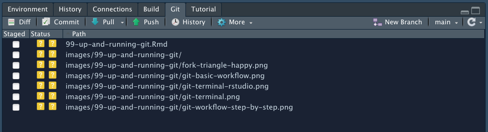
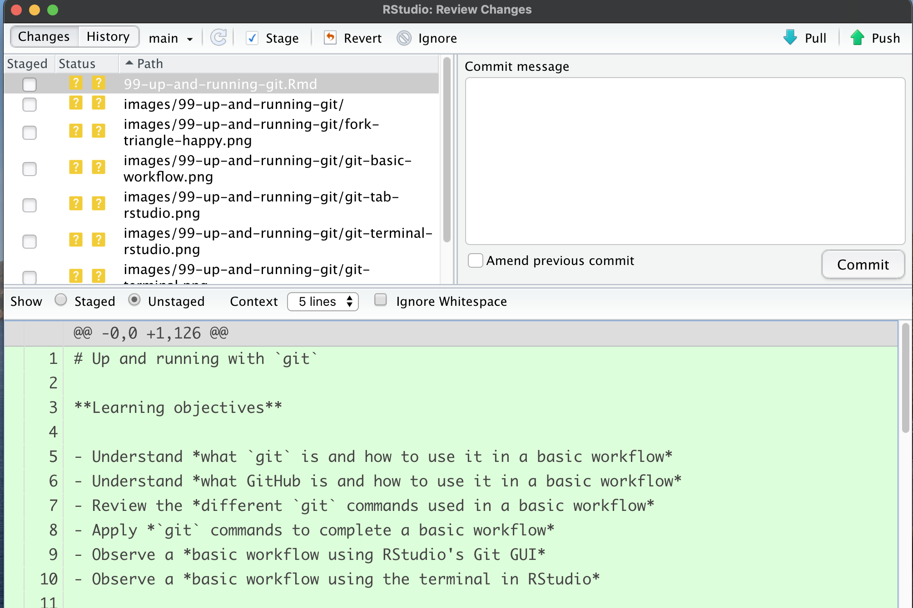
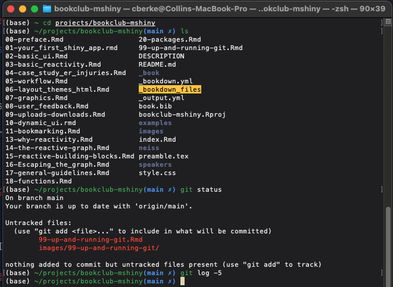
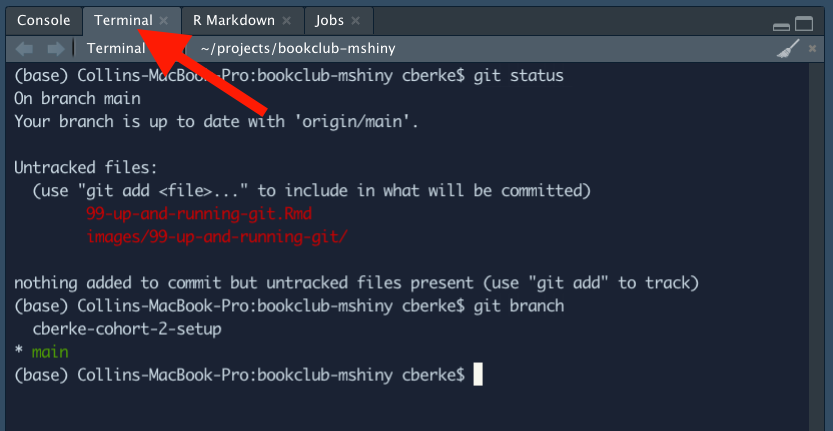
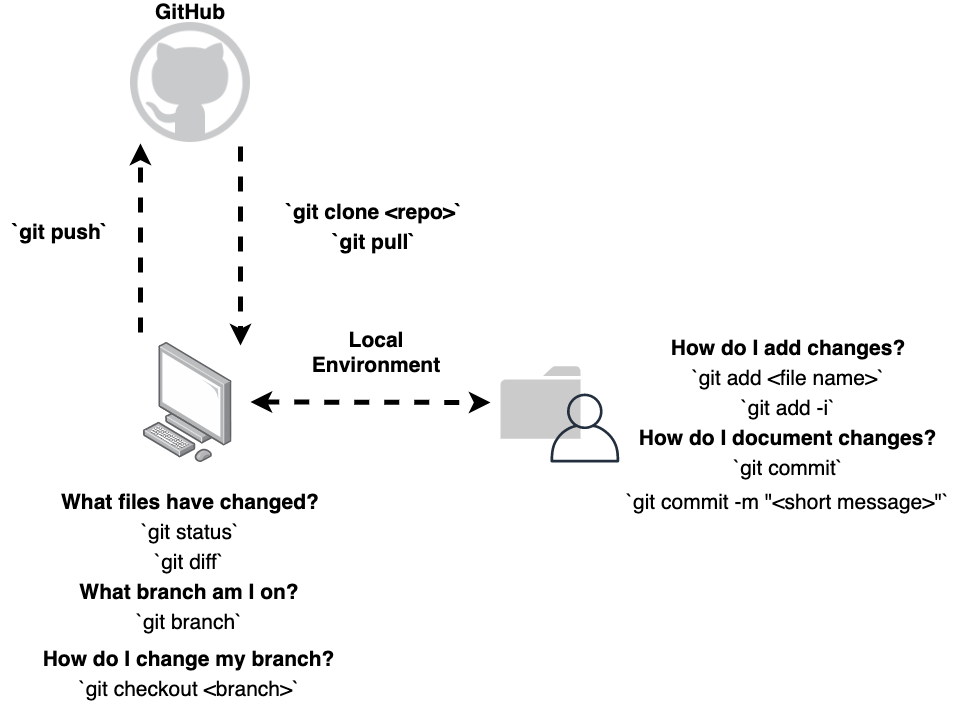
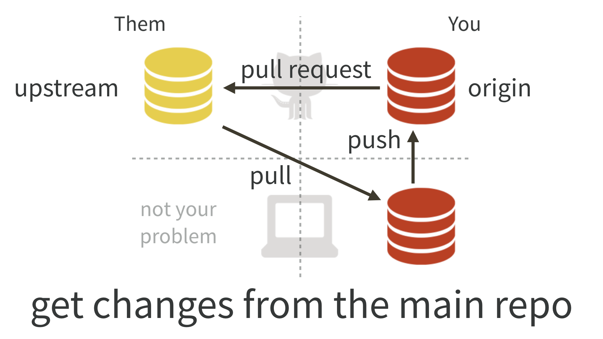

# (PART\*) Other topics {-}

# Up and running with `git`

**Learning objectives**

- Understand *what `git` is and how to use it in a basic workflow*
- Understand *what GitHub is and how to use it in a basic workflow*
- Review the *different `git` commands used in a basic workflow*
- Apply *`git` commands to complete a basic workflow*
- Observe a *basic workflow using RStudio's Git GUI*
- Observe a *basic workflow using the terminal in RStudio*

## What is `git`?

* `git` is a version control system. 

* Assists developers* when collaborating on big projects.
    
  + *Data scientists and analysts have adapted it for their needs.

* Manages the set of files (i.e., a *repository (or repo for short)*) in a structured way.

* Two ways to think about `git`:

   + It takes snapshots, catalogs, and assists in the documentation of changes to your files.

   + It is like Microsoft Word's "Track Changes" on steroids.

## Accessing and using `git`

A myriad of ways are available to use `git` in your workflow (assuming `git` is installed on your computer).

The two most common are:

(@) Using a Graphical User Interface (GUI) Client (you must install some of these)

   i) Examples can be found [here](https://git-scm.com/downloads/guis).
   i) Built in Git window pane in RStudio

(@) Using terminal commands

   i) System terminal
   i) Rstudio terminal
    
## Example using the built in RStudio `git` GUI.

* Here's an example of the Git window pane in Rstudio.



* Here's an example of the `git` sub-menu in RStudio.



## Example using `git` in a system terminal

* Here's an example using a system terminal. Terminal is set up with [`oh my zsh`](https://ohmyz.sh/) running on a Mac Computer.    



### Example using `git` in RStudio's terminal

* Here's an example of using RStudio's integrated terminal (Windows users might find this useful). 
* This tab should be near the `Console` tab. If not, you may have to adjust your settings or open a new terminal. 



## What is GitHub?

* [GitHub](https://github.com/) is a hosting service for your projects.

> Think of it as DropBox, but much, much better ~Jenny Bryan, STAT 545 TAs, & Jim Hester (Happy Git and GitHub for the useR)

* It's a collaboration, project management, and social media platform. 

* Provides many tools to improve/work on your project.


### Other services like GitHub

* [Bitbucket](https://bitbucket.org/)


* [GitLab](https://about.gitlab.com/)


* Although these services are different, the fundamentals are still the same across the platforms. 

## A basic workflow - pull, commit, and push

* There are many tools that `git` and GitHub provides. 
    + Just check out the [Pro Git book](https://git-scm.com/book/en/v2). 

* Let's look at a basic, common workflow: tracking and documenting changes to our project.
    + `pull`, `commit`, and `push`

## Personal repo workflow step-by-step

* Here's a step-by-step visualization of the workflow. 
        
  + These are the common steps and there are many approaches to do what is explained here. 

  + Using these commands in the same steps might not matter. You will find yourself using similar patterns over and over, however. 
    
      - **Pull, make changes, add, commit, push**

  + The commands you use and in what order you use them is based on the current state of the project. 


## Personal repo workflow alternative view

* Here's the same workflow. It is just visualized a different way. 



## Fork, clone, push, and pull workflow (collaboration)

* This diagram is from the [Happy Git and GitHub for the useR book](https://happygitwithr.com/). 

* **This is how you can make changes to the bookclub's review materials.**

* It overviews the workflow when working with a forked repository.

* We will come back to this at a later time, once we start developing the app. 



### Some notes about these workflows
* They will not always run smoothly
   + Errors and issues are inevitable (merge conflicts...ugh)
   + Read the prompts and try to solve the issue, Google is your friend
   
* Git can be frustrating at times
   + Don't worry about being perfect
   + Getting good takes practice

## Workflow commands

* The following are common commands to perform the previously discussed workflow in a terminal. 

* `git` has many commands, each having multiple options to modify behavior. 

    + Want to know more, check out the [Pro Git book](https://git-scm.com/book/en/v2).   

### Get Remote Repo/Update Local Repo
    
  * `git clone <repo url>` (only needs to be run once*): pulls files into a directory (file)
  * `git pull`: retrieves changes from the remote repo

### View info about local files

  * `git branch`: see what branch you are on locally.
  * `git status`: see what files have changed locally.
  * `git diff`: see specific changes in the files.
    
### Stage and document changes

  * `git checkout <branch name>`: change your branch if needed.
  * `git add <file name>`: stage the file for documentation.
  * `git add -i`: interactive module for staging. Great for when you have lots of files to commit.
  * `git commit`: opens text editor to document changes.
     + If `vim` opens: Press `i` (insert) >> add your subject line >> draft your message >> `Esc` >> `:+x` >> `Enter`.
  * `git commit -m <message>`: Short version for drafting commit messages. 
    
### Push changes to remote repository    
    
  * `git push`: push changes to remote repo (GitHub)

## Demo of the workflow

1. Workflow using the GUI

    * Video will be added soon

2. Workflow using the terminal

    * Video will be added soon

## Other resources to learn more about `git`

1. Keep coming to this group, we will discuss more advanced topics surrounding the use of `git` 

2. [Happy Git and GitHub for the useR](https://git-scm.com/book/en/v2)

3. [Pro Git (free and available online)](https://git-scm.com/book/en/v2)

4. [Learn git branching, the game](https://learngitbranching.js.org/)

5. [How Does Git Work? (A more in-depth blog on git internals)](https://www.honeybadger.io/blog/how-does-git-work/)

6. `@Tan` in the R4DS Slack put together some [videos](https://www.youtube.com/playlist?list=PL3x6DOfs2NGhS_PhklqT6PwK1Fh7blgP2).

## Meeting Videos

### Cohort 2

#### 2021-07-21: Initial meeting, overview of `git` workflows. {-}

`r knitr::include_url("https://www.youtube.com/embed/beOYuHG9Xng")`

#### 2021-07-28: Demonstration using the RStudio terminal to perform `git` operations (Beginning of session). {-}

`r knitr::include_url("https://www.youtube.com/embed/UfYv0Jp4yIQ")`

<details>
  <summary> Meeting chat logs </summary>
  
```
# Meeting 2021-07-21
00:01:07	Zaynaib Giwa, @zaynaib:	Hello Collin
00:01:24	Collin Berke:	Hello! I will jump in here shortly.
00:01:35	Ola:	Hello Eileen
00:10:41	Conor Tompkins:	Indexing the chapters at 0? Brave move lol
00:31:23	Ola:	git bash for windows if you are a terminal person
00:32:24	Kevin Gilds:	use both terminal and Rstudio gui-depends
00:32:41	Conor Tompkins:	I use RStudio + GitHub.com. terminal if I need to delete old branches
00:34:56	Kevin Gilds:	Linux!
00:35:07	Ola:	windows has a terminal
00:35:29	Ola:	https://www.microsoft.com/en-us/p/windows-terminal/9n0dx20hk701?activetab=pivot:overviewtab
00:35:37	Ola:	here is the app for windows terminal its awesome
00:38:01	Ola:	if you are windows and want to run a ubntu on it without dual booting https://docs.microsoft.com/en-us/windows/wsl/install-win10
00:43:37	Conor Tompkins:	Azure is another one
01:00:08	Ola:	If you do commit large files use git-lfs
01:00:33	Ola:	https://git-lfs.github.com/
01:06:16	Conor Tompkins:	There is this channel in the slack: help-5-github_open_source
01:06:42	Sandra:	Thanks
01:07:19	Maria C Ramos:	Thank you!

# Meeting 2021-07-28
00:15:20	Ola:	you are on mute
00:30:25	Ola:	it sounds like you need to setup your ssh key
00:30:27	Ola:	https://docs.github.com/en/github/authenticating-to-github/connecting-to-github-with-ssh/generating-a-new-ssh-key-and-adding-it-to-the-ssh-agent
00:31:11	Conor Tompkins:	RStudio sort of combines git add and git commit.
00:36:19	Ola:	yes
00:46:54	Conor Tompkins:	It would be interesting to know whether you can use a port number below 1023. Those are reserved for specific uses
00:48:15	Ola:	You can assign an application a port number. 
00:48:58	Ola:	There are some default ports for certain applications like postgres I think its like port 5410 … don't quote me on that
00:49:45	Ryan Metcalf:	Many APIs utilize particular ports when communicating to different servers. Redis, Postgres, SQLServer, etc…
00:49:52	Ryan Metcalf:	HTML by default is 80 or 8080.
00:50:17	Ryan Metcalf:	SSH, FTP, SFTP, are 21, 22, 23, etc…
00:51:35	Eileen:	Shiny:: cheat sheet
00:54:43	Ola:	Maybe we should have a debugging zoom party one of these days
```
</details>